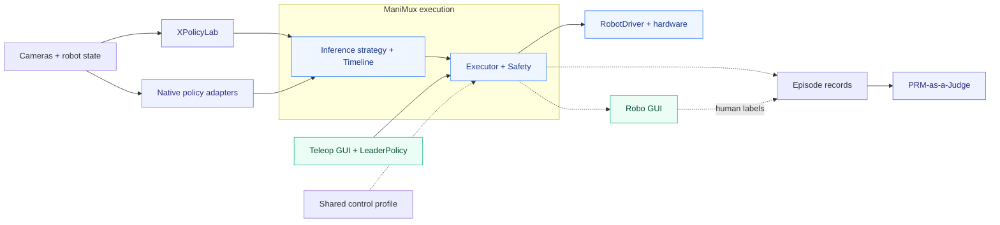

# ManiMux
**A composable platform for real-robot experiments.**

Any Policy × Embodiment × Inference

 

 

 

[English](README.md) · [简体中文](README.zh-CN.md)

[**Features**](#features) · [**Demo**](#demo) · [**Architecture**](#architecture) · [**Guideline**](docs/guideline.md) · [**Documentation**](docs/README.md)

**ManiMux is a real-robot experiment platform for data collection, policy deployment and evaluation.**
It decouples policies, inference strategies, executors and embodiments, so researchers can compare
methods on a shared control stack, operate trials through a GUI, and inspect what the robot actually executed.

> Installation and startup commands: [Guideline](docs/guideline.md). Model and method details: [Documentation](docs/README.md).

## Features

| Feature | Status | What it provides |
|---|:---:|---|
| Composable deployment | ✅ | Policy × inference strategy × executor × embodiment |
| Inference methods | ✅ | Async, serial, RTC, PAINT and adaptive chunking |
| Robo GUI | ✅ | Rollout controls, cameras, 3D state, trajectories and chunk timelines |
| Teleop collection | ✅ | Leader policy + YAM GUI, with ManiMux follower control |
| Shared control profiles | ✅ | Common hardware settings, action timing and arm / gripper limits |
| Execution evidence | ✅ | Configs, observations, actions, commands, feedback, events and video |
| Evaluation | ✅ | Human labels + offline PRM / LLM judging |
| UMI / DAgger collection | — | [Collection roadmap](docs/README.md#collection-status) |

✅ denotes implemented functionality, not validation of every model / hardware combination.
[Support counts](docs/README.md#support-counts) also include model-only and simulation paths.

## Demo

## Architecture

Teleoperation reuses execution interfaces without chunk scheduling; it retains its own GUI and recording format.

**GitHub:** [ManiMux](https://github.com/SII-LiuLab/manimux) · [XPolicyLab](https://github.com/Cuzyoung/XPolicyLab) · [PRM-as-a-Judge](https://github.com/YuyangLiu2003/PRM-as-a-Judge)

## Guides

- **Run:** [Guideline](docs/guideline.md) · [Configuration](configs/README.md).
- **Integrate:** [Components and policy runbooks](docs/README.md) · [Inference methods](docs/README.md#inference-and-execution).
- **Collect / evaluate:** [YAM collection](docs/yam-collection.md) · [Experiment workflow](docs/experiment-infra.md) · [PRM guide](docs/prm-as-a-judge.md).
- **Extend:** [Architecture contracts](docs/architecture.md).

Physical robots require matching model contracts and hardware safety measures; software checks do not certify safety or task success.
Upstream attribution: [notices](THIRD_PARTY_NOTICES.md) · [licenses](licenses).
