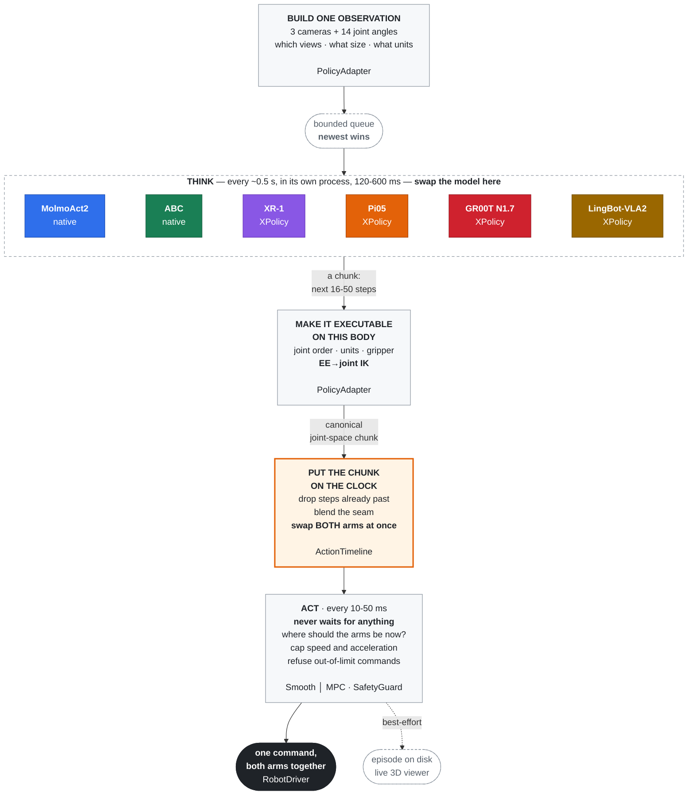

<div align="center">

<h1></h1>

Compose policies, robot embodiments and inference strategies.<br/>
Run, visualize, record and evaluate experiments in one shared framework.

[](https://www.python.org/)
[](https://docs.astral.sh/ruff/)
[](https://mypy-lang.org/)
[](docs/molmoact-yam-runbook.md)
[](https://github.com/SII-LiuLab/manimux/commits)

[English](README.md) · [简体中文](README.zh-CN.md)

**[Quick Start](#ten-minute-hardware-free-start) · [Policies](#integrations) · [Inference](#inference-algorithm-roadmap) · [Viewer](docs/viewer-tutorial.html) · [Evaluation](#offline-video-evaluation-prm-as-a-judge) · [Docs](#documentation)**

</div>


<p align="center"><em>A real-robot rollout in ManiMux: live camera views, robot visualization and an action-chunk timeline.</em></p>

## ManiMux in 30 Seconds

**ManiMux is a unified real-robot experiment platform built around an asynchronous inference
runtime.** The policy decides what should happen next; ManiMux decides when and how to execute it
smoothly and safely, then records the complete run for inspection and evaluation.

| Policy | Embodiment | Inference |
|---|---|---|
| Plug in a policy through a shared adapter contract | Map observations and actions through robot-specific adapters | Swap scheduling and sampling strategies while sharing the execution layer |

The goal is composability, not a separate deployment stack for every combination. Current
hardware validation centers on dual YAM; see [integrations](#integrations) and the
[algorithm roadmap](#inference-algorithm-roadmap) for the status of individual combinations.

```text
cameras + robot state
        ↓
Policy / XPolicy model     predicts the next 16-50 action steps
        ↓
PolicyAdapter              converts them into executable robot joints
        ↓
ManiMux Runtime + Strategy schedules inference, trims stale actions and checks safety
        ↓
Robot                      submits both arms atomically on one control tick

Side outputs: Recorder episode + 3D Viewer
```

Remember three rules:

1. **The model never commands the robot directly.** It only returns a future action chunk.
2. **The adapter translates semantics.** Joint, EE-pose and delta outputs become one canonical chunk.
3. **ManiMux executes.** Control timing, Timeline, Safety and Recorder are not copied per model.

### Real-Robot Experiment Platform

ManiMux is also a repeatable experiment surface, not only a deployment runtime:

| Capability | What it gives the operator |
|---|---|
| Config-composed experiments | Swap the policy, inference strategy and embodiment without rewriting the control loop |
| Viewer-controlled rollouts | Prepare, start, finish and home each trial from one guided interface |
| Live action-chunk timeline | See inference latency, stale-prefix trimming, RTC conditioning, chunk handoff and gripper events while the robot runs |
| Synchronized evidence | Save resolved config, observations, raw/committed actions, robot states, events and camera video under one rollout |
| Human evaluation mode | Attach task result, smoothness and failure tags to a finished rollout for later comparison |

Normal mode keeps the same Viewer workflow without requiring labels. Experiment mode requires an
evaluation before advancing, so large real-robot studies do not silently lose human annotations.

## Ten-Minute Hardware-Free Start

```bash
git clone --recursive https://github.com/SII-LiuLab/manimux.git
cd manimux
uv sync --dev
uv run manimux run --config configs/mock.yaml
```

`configs/mock.yaml` uses a fake robot, camera and policy while exercising the real worker,
Timeline, SmoothExecutor, SafetyGuard and Recorder. It runs `120` control ticks and writes one
episode under `data/`; it never touches a camera, CAN interface or physical arm.

Launch the independent YAM viewer demo:

```bash
uv run manimux-viewer --robot yam --demo --port 8086
```

Open `http://localhost:8086`. The `--demo` process is a standalone visualization demo, not a live
view of the mock runtime above.

For the live rollout state machine, button meanings, experiment labels and recovery flow, open the
[Viewer visual tutorial](docs/viewer-tutorial.html).

### Try Three Safe Changes

Copy the config first so the repository baseline stays unchanged:

```bash
cp configs/mock.yaml /tmp/manimux-beginner.yaml
```

Change one field at a time and rerun:

| Change | Suggested value | What it demonstrates |
|---|---:|---|
| `run.max_steps` | `120 → 300` | Control ticks and the episode lifecycle |
| `policy.inference_delay_s` | `0.04 → 0.20` | The control loop does not block on a slower model |
| `execution.blend_steps` | `0 / 2 / 8` | The seam between consecutive action chunks |

Read the first config as seven blocks: `run` defines the experiment, `robot` the embodiment,
`sensors` the observation, `policy` the model and chunk, `execution` scheduling and commands,
`viewer` live display, and `recording` the recording policy (the current runtime always records).
See the
[field-by-field config tour](configs/README.md#第一份配置configsmockyaml).

## Where Beginners Should Look

| Path | Think of it as |
|---|---|
| `configs/` | Experiment entry points: model, embodiment, checkpoint and runtime |
| `docs/*-runbook.md` | Operating instructions for installing, starting, checking and stopping a model |
| `src/manimux/` | Shared engine: runtime, robot, sensor, safety, recording and viewer |
| `XPolicyLab/` | Model internals: adapters and samplers for Pi05, GR00T, XR-1 and LingBot |
| `data/` | Run output: resolved config, actions, states, events and episode result |

Running experiments normally requires only `configs/` and one runbook. Enter `src/manimux/` to
change shared infrastructure, and enter `XPolicyLab/` only for model preprocessing, flow denoising
or model-native RTC sampling.

## Purpose

Chunk-based policy inference is commonly slower than a robot control period.
ManiMux moves inference out of the control loop and owns replaceable inference strategies,
chunk scheduling, stale-prefix trimming,
atomic dual-arm commits, execution constraints, safety checks, recording and live visualization.

ManiMux is not tied to one model library. MolmoAct and ABC have native service adapters;
additional foundation models enter through `XPolicyLab/`. ManiMux keeps the stable runtime and
wire bridge. Model preprocessing, flow denoising and model-native RTC sampling stay in the
XPolicyLab adapter; embodiment mapping and execution safety stay in ManiMux.

## Architecture

Two loops at different speeds. The whole design is about the hand-off between them.



**The control loop never waits** — not for the model, disk, viewer, or a log line.
**A stale or invalid chunk never reaches the robot** — wrong session, old sequence,
past deadline, bad shape, non-finite value, or a dual-arm plan the two arms disagree
on drops the *whole* chunk with a logged reason.

The real-robot control loop exists only once. Its inference strategy is replaceable:
the default strategy refills when the Timeline runs low, while RTC derives a condition
and soft mask from real execution progress. XPolicy advertises sampler capabilities at
handshake time, so an RTC config fails before robot connection when the live model has no
`get_action_rtc` hook.

## Repository Layout

| Path | Responsibility |
|---|---|
| `src/manimux/runtime/` | One control loop plus pluggable inference strategies, Timeline, Smooth/MPC and Safety |
| `src/manimux/policies/` | `PolicyModel` / `PolicyAdapter` contracts and isolated worker |
| `src/manimux/integrations/` | Native integrations and the shared XPolicy WebSocket bridge |
| `src/manimux/robots/` | RobotDriver implementations; dual YAM is the current hardware target |
| `src/manimux/sensors/` | RealSense and the shared camera service |
| `src/manimux/recording/` | Episodes, Zarr, events and action lineage |
| `src/manimux/viewer/` | Generic viewer protocol and robot geometry adapters |
| `XPolicyLab/` | Submodule pointing to our XPolicyLab fork; model-internal changes live here |
| `checkpoints/pretrained/` | Unmodified foundation-model or upstream release weights |
| `checkpoints/finetuned/<publisher>/` | Fine-tuned checkpoints, named after their published repository |
| `configs/<model>/<embodiment>/` | One explicit configuration per model and embodiment experiment |
| `docs/*-runbook.md` | Per-model environment, checkpoint, contract and default startup |
| `docs/reproductions/` | Per-method equations, integration, commands, evidence and review records |

For example, the Robocurve YAM releases live at
`checkpoints/finetuned/robocurve/{pi05-yam-molmoact2,gr00t-n1.7-yam-molmoact2}`;
the official OpenPI `pi05_base` remains under `checkpoints/pretrained/`.

## Integrations

Status: ✅ running · 🧪 experimental · 🚧 not deployable yet · 🔌 infrastructure

| Status | Model/path | ManiMux canonical action | Config | Runbook |
|---|---|---|---|---|
| ✅ | MolmoAct2 + YAM | 30 × 14 joint positions | `configs/molmoact2/yam/` | [MolmoAct2](docs/molmoact-yam-runbook.md) |
| ✅ | ABC + YAM | 30 × 14 joint positions | `configs/abc/yam/` | [ABC](docs/abc-yam-runbook.md) |
| ✅ | OpenPI Pi05 + YAM | 16/50 × 14 absolute joint positions | `configs/pi05/yam/` | [Pi05](docs/pi05-yam-runbook.md) |
| ✅ | GR00T N1.7 + YAM | 16 × 14 absolute joint positions | `configs/groot/yam/` | [GR00T](docs/gr00t-yam-runbook.md) |
| ✅ | XR-1 + YAM | `30×60` EE delta → `30×14` joints | `configs/xiaomi-xr1/yam/` | [Runbook](docs/xiaomi-xr1-yam-runbook.md) |
| ✅ | LingBot-VLA2 + YAM | `50×14` arm-relative + absolute gripper → joints | `configs/lingbot-vla2/yam/` | [Runbook](docs/lingbot-vla2-yam-runbook.md) |
| 🔌 | SAPolicy + YAM (XPolicyLab WS) | absolute dual-EE → YAM joints via `sapolicy_yam` | `configs/sapolicy/yam/` | [Runbook](docs/sapolicy-yam-runbook.md) |
| 🧪 | Cosmos3 DROID | `32×8` single-arm absolute joints; offline only | `XPolicyLab/policy/Cosmos3/` | [Offline runbook](docs/cosmos3-offline-runbook.md) |
| 🚧 | Isaac 0.5 LIBERO | `8×7` checkpoint-native absolute EE; model-only | `configs/isaac05/libero/` | [Offline runbook](docs/isaac05-offline-runbook.md) |
| 🔌 | XPolicy bridge | Observation/action wire contract | `configs/xpolicylab/yam/` | [Runbook](docs/xpolicylab-runbook.md) |

Here ✅ means the GPU/server, camera, adapter, scheduling, robot and Recorder path has been exercised;
it does not claim task success or YAM post-training quality. Model-specific checkpoints, action
contracts, known failures and evidence stay in the linked runbooks.

## Inference Algorithm Roadmap

Status: ✅ hardware exercised · 🧪 integrated and offline verified · 🚧 integrating · 📋 planned ·
👀 tracked but training-dependent. Completion means the method path has run on hardware; it does not
mean that every policy succeeds at the task or that every method performs well. All methods in the
main list run from an existing checkpoint without user retraining.

| Status | Algorithm | Integration layer | Current evidence | Method documentation | Upstream |
|---|---|---|---|---|---|
| ✅ | Default (ManiMux asynchronous chunk execution) | Runtime | Exercised across the current dual-YAM model integrations | [Architecture](docs/architecture.md) | This repository |
| ✅ | RTC (inference-time Pi-guided) | Flow sampler + Runtime | Pi05/YAM hardware; measured `d=3–5`, no post-start chunk gap | [XPolicy RTC contract](docs/xpolicylab-runbook.md#rtc-规则) | [Paper](https://arxiv.org/abs/2506.07339) · [Kinetix code](https://github.com/Physical-Intelligence/real-time-chunking-kinetix) |
| ✅ | ACT Temporal Ensembling | Runtime | Pi05 step-1000/YAM hardware; operator observed smooth continuous execution | [Method](docs/act-temporal-ensemble.md) | [Pinned ACT source](https://github.com/tonyzhaozh/act/blob/742c753c0d4a5d87076c8f69e5628c79a8cc5488/imitate_episodes.py#L191-L259) · [LeRobot](https://github.com/huggingface/lerobot) |
| ✅ | Adaptive Action Chunking (AAC) | Pi05/GR00T multi-sample + Runtime | Pi05 step-1000/YAM hardware; functional but visibly pauses at roughly `0.51 s` warmed latency | [Core audit](docs/reproductions/aac.md) · [Pi05 audit](docs/reproductions/aac-pi05.md) | [GR00T server](https://github.com/Adaptive-Action-Chunking/gr00t-multi-sample/tree/11e926b0f34cf6acfcb92c0fe6127a1bdc7b856a) · [official selector](https://github.com/Adaptive-Action-Chunking/robocasa/blob/fed3e6b5eb348160dd0570f326f726758fee9056/robocasa/demos/action_optimization/action_entropy_v2.py) |
| ✅ | PAINT paper reproduction | Pi05 flow sampler + Runtime | Pi05 step-1000/YAM hardware; operator observed markedly improved continuity | [Pi05 audit and commands](docs/reproductions/paint-pi05.md) | [Paper](https://arxiv.org/abs/2606.19774) · [official repository](https://github.com/htrbao/paint-action-chunking) currently contains documentation only |
| ✅ | AutoHorizon JAX port | Pi05 action-expert introspection + synchronous Runtime | Pi05/YAM hardware exercised; faithful synchronous cadence caused visible inference holds | [Pi05 audit and commands](docs/reproductions/autohorizon-pi05.md) | [Code](https://github.com/hatchetProject/AutoHorizon/tree/c7504f1756109103f2cfcc2e23f1b1a23841c885) |
| 📋 | SGAC | Diffusion-policy sampler + Runtime | Official release targets low-dimensional Diffusion Policy; a Pi05 flow port would be a non-official extension | — | [Code](https://github.com/junhyukso/SGAC/tree/b885b0acfca214c30a65e1ae24323d3b98c82e76) |
| ✅ | DVAC paper reproduction | Pi05 flow sampler + Runtime | Pi05/YAM hardware exercised; trajectory judged more accurate than the preceding method, with synchronous pauses | [Pi05 audit](docs/reproductions/dvac-pi05.md) | [Paper](https://arxiv.org/abs/2606.03847) · official code not located |
| 📋 | ProbeFlow | Flow solver acceleration | Denoising velocity probes | — | [Paper](https://arxiv.org/abs/2603.17850) · official code not located |
| 📋 | DiscreteRTC | Discrete-diffusion sampler | Requires a compatible pretrained masked-token policy | — | [Code](https://github.com/outsider86/DiscreteRTC) · [StarVLA](https://github.com/starVLA/starVLA) |

## From Mock to Real Models

Update submodules in an existing checkout:

```bash
git submodule update --init --recursive
```

The core development environment uses `./.venv`, the YAM runtime uses `envs/yam/.venv`, and model
servers use isolated environments. Follow [the environment guide](envs/README.md) and one model
runbook for CUDA, Torch, checkpoints, preflight and safe shutdown.

### Real-Robot Quick Start: YAM

Start the two model-independent services once:

```bash
# Terminal 1: cameras
envs/yam/.venv/bin/manimux-camera-server --config configs/cameras.yaml
```

```bash
# Terminal 2: Viewer
envs/yam/.venv/bin/manimux-viewer --robot yam --host 0.0.0.0 --port 8086
```

Then choose exactly one model recipe. Each recipe starts its model server, performs one
no-CAN forward/adapter probe, and starts the Viewer-controlled runtime. Do not run two model
recipes or two ManiMux runtimes for the same robot simultaneously.

#### Pi05 step-15000

```bash
# Run every command from the repository root:
cd /home/ubuntu/manimux

# Terminal 3: policy server
XPolicyLab/policy/Pi_05/openpi/.venv/bin/python \
  scripts/servers/pi05_yam_server.py \
  --config configs/pi05/yam/server/finetune-assemble-screwdriver-step15000.yaml
```

```bash
# Terminal 4: probe, then runtime service
envs/yam/.venv/bin/python scripts/validation/xpolicylab_yam_forward_probe.py \
  --config configs/pi05/yam/infra/manimux-assemble-screwdriver-step15000.yaml

envs/yam/.venv/bin/manimux serve \
  --config configs/pi05/yam/infra/manimux-assemble-screwdriver-step15000.yaml
```

To use Pi05's inference-time RTC strategy, keep the same policy server running and use the
RTC runtime configuration below. The server is started only once; do not start a second Pi05
server on port `8500`.

```bash
# Terminal 4: optional no-CAN probe against the RTC contract
cd /home/ubuntu/manimux
envs/yam/.venv/bin/python scripts/validation/xpolicylab_yam_forward_probe.py \
  --config configs/pi05/yam/infra/rtc-assemble-screwdriver-step15000.yaml

# Terminal 5: ManiMux + Pi-guided RTC runtime
envs/yam/.venv/bin/manimux serve \
  --config configs/pi05/yam/infra/rtc-assemble-screwdriver-step15000.yaml
```

The ordinary Pi05 recipe uses `manimux-assemble-screwdriver-step15000.yaml` (`runtime: manimux`);
the RTC recipe uses `rtc-assemble-screwdriver-step15000.yaml` (`runtime: rtc`). Choose one
runtime for a rollout, never both at the same time.

#### LingBot-VLA2 step-15000

```bash
# Terminal 3: policy server
bash XPolicyLab/policy/LingBot_VLA2/setup_eval_policy_server.sh \
  configs/lingbot-vla2/yam/server/finetune-assemble-screwdriver-step15000.yaml
```

```bash
# Terminal 4: probe, then runtime service
envs/yam/.venv/bin/python scripts/validation/xpolicylab_yam_forward_probe.py \
  --config configs/lingbot-vla2/yam/infra/manimux-assemble-screwdriver-step15000.yaml

envs/yam/.venv/bin/manimux serve \
  --config configs/lingbot-vla2/yam/infra/manimux-assemble-screwdriver-step15000.yaml
```

For sampler-level RTC, keep the same LingBot policy server and replace the runtime config:

```bash
envs/yam/.venv/bin/manimux serve \
  --config configs/lingbot-vla2/yam/infra/rtc-assemble-screwdriver-step15000.yaml
```

#### Xiaomi XR-1 step-15000

```bash
# Terminal 3: policy server
envs/xr1/.venv/bin/python scripts/servers/xiaomi_xr1_yam_server.py \
  --config configs/xiaomi-xr1/yam/server/finetune-assemble-screwdriver-step15000.yaml
```

```bash
# Terminal 4: probe, then runtime service
envs/yam/.venv/bin/python scripts/validation/xpolicylab_yam_forward_probe.py \
  --config configs/xiaomi-xr1/yam/infra/manimux-assemble-screwdriver-step15000.yaml \
  --instruction "Assemble the screwdriver."

envs/yam/.venv/bin/manimux serve \
  --config configs/xiaomi-xr1/yam/infra/manimux-assemble-screwdriver-step15000.yaml
```

For sampler-level RTC, keep the same XR-1 policy server and replace the runtime config:

```bash
envs/yam/.venv/bin/manimux serve \
  --config configs/xiaomi-xr1/yam/infra/rtc-assemble-screwdriver-step15000.yaml
```

Open `http://localhost:8086`, then operate Viewer in this order:

1. Confirm the task command and, for experiments, enter a layout/condition ID.
2. Click `Prepare normal rollout`, or `🧪 Prepare experiment rollout` when labels are required.
3. Wait for `Connected · PAUSED`, then click `Start rollout`.
4. Use `Pause / Hold` only when execution must stop without ending the rollout.
5. Click `Finish & Home` to stop, save the episode, and run the configured home path.
6. After an experiment rollout, select the result and smoothness score, then save the evaluation.

Viewer shows only the controls for the current stage. The main viewport keeps a top/left/right
camera wall beside the robot digital twin, so live images do not require sidebar scrolling. A
two-lane action timeline below the cameras shows inference in progress, the active chunk cursor,
RTC-conditioned overlap, commit-time trimming, and the old tail replaced at each chunk switch.

These snippets show entry points only. They do not replace checkpoint validation, preflight,
CAN checks or shutdown procedures. Model setup stays in its runbook; ACT, AAC, PAINT and later
strategy commands stay in the linked method documentation in the algorithm list.

## Offline Video Evaluation: PRM-as-a-Judge

ManiMux includes **PRM-as-a-Judge 1.5** as the `PRM-as-a-Judge/` submodule. Our
recorded-video evaluations use **Robo-Dopamine-GRM-2.0-8B-Preview** as the judge.
This runs offline; it does not start a robot or a policy server.

**The current entry point requires a JSONL manifest, not just a video root directory.**
Save one JSON object per rollout in a file such as `data/prm/manifest.jsonl`:

```json
{"case_id":"pi05-rollout-003","task":"Assemble the screwdriver.","video":"/absolute/path/to/session/rollout-003/videos/front_camera.mp4","model":"pi05_step15000","benchmark":"yam_real_top"}
```

`case_id`, `task` (or `instruction`), and `video` are required. Relative video paths resolve
against the manifest's directory. Add more lines to evaluate multiple rollouts or models;
use distinct case IDs and set `model` for grouped comparisons. No human success label is required.
For our YAM top-view setup, select `front_camera.mp4` only. The Dopamine adapter repeats that
single video into its three camera slots; this is **top-only**, not three-view evaluation.

From the repository root, with the dedicated `prm-judge` Conda environment installed:

```bash
git submodule update --init PRM-as-a-Judge

PRM_GPU_MEMORY_UTILIZATION=0.68 \
conda run --no-capture-output -n prm-judge python scripts/evaluation/prm_as_a_judge.py eval \
  --manifest data/prm/manifest.jsonl \
  --prm dopamine \
  --prm-path checkpoints/pretrained/Robo-Dopamine-GRM-2.0-8B-Preview \
  --output-root data/prm/results \
  --gpus 0 --eval-mode forward --frame-interval 72 --batch-size 10 \
  --outlier-method none --smoothing none --visualize
```

The weights are local and excluded from Git. `--frame-interval 72` means one sample every
72 source frames, not 72 samples per video. Results appear in `data/prm/results/run_*/`:
`run_summary.json`, `per_case.jsonl`, `metrics.xlsx`, `report.md`, and `visualizations/report.html`.
The toolkit computes progress/process metrics including MC@25/50/75, MP, PPL, CRA, STR and DRR;
you can report these without making success rate the headline result.
For environment setup, input views and report interpretation, see the
[PRM usage guide](docs/prm-as-a-judge.md).

## Configuration Convention

```text
configs/
  <model>/
    <embodiment>/
      server/              # model-service configs
        <checkpoint>.yaml
      infra/               # ManiMux robot, sensors, execution and recording
        <experiment>.yaml
  cameras.yaml
  robots/
  mock.yaml
```

One experiment uses one explicit config. Different checkpoints, runtimes and embodiments do not
share hidden switches. See [configs/README.md](configs/README.md) for naming rules.

## Adding a Model or Embodiment

| Boundary | Responsibility |
|---|---|
| `PolicyModel` | Call a local model or model service; never touch the robot |
| `PolicyAdapter` | Camera/state encoding, action decoding, normalization, joint mapping and FK/IK |
| `RobotDriver` | Vendor SDK, state, commands, home, stop and close |
| `SensorDriver` | Read named, timestamped sensor streams |
| `RobotAdapter` | Viewer URDF, FK, joint groups and appearance |

Changing a model only changes the two Policy layers. Changing a robot only changes the embodiment
adapter, driver and config. Runtime, Timeline, Safety, Recorder and the viewer protocol are not
copied per model. See [Architecture](docs/architecture.md) for the complete contracts.

## Documentation

- [PRM-as-a-Judge offline video evaluation](docs/prm-as-a-judge.md)
- [Real-robot experiment design](docs/experiment-design.md)
- [Experiment infrastructure and Viewer workflow](docs/experiment-infra.md)
- [Viewer visual tutorial](docs/viewer-tutorial.html)
- [XPolicyLab integration](docs/xpolicylab-runbook.md)
- [MolmoAct2](docs/molmoact-yam-runbook.md) · [ABC](docs/abc-yam-runbook.md)
- [Pi05](docs/pi05-yam-runbook.md) · [GR00T](docs/gr00t-yam-runbook.md) · [XPolicy XR-1](docs/xiaomi-xr1-yam-runbook.md)
- [LingBot-VLA2](docs/lingbot-vla2-yam-runbook.md) · [SAPolicy](docs/sapolicy-yam-runbook.md) · [CAN bus](docs/can-bus.md)
- [YAM 三模型训练流程](docs/yam-training-pipeline.md)
- [Cosmos3 offline](docs/cosmos3-offline-runbook.md) · [Isaac 0.5 offline](docs/isaac05-offline-runbook.md) · [ManiUniCon simulation](docs/maniunicon-sim.md)
- [Architecture](docs/architecture.md)

## Safety

ManiMux drives physical robots. Passing tests does not prove hardware safety, and software cannot
replace a physical emergency stop, hardware limits or the vendor watchdog. The runtime starts
paused, faults do not auto-recover, and every hardware entry point requires its runbook preflight.

## License

See [THIRD_PARTY_NOTICES.md](THIRD_PARTY_NOTICES.md) and [`licenses/`](licenses) for upstream
attribution.
