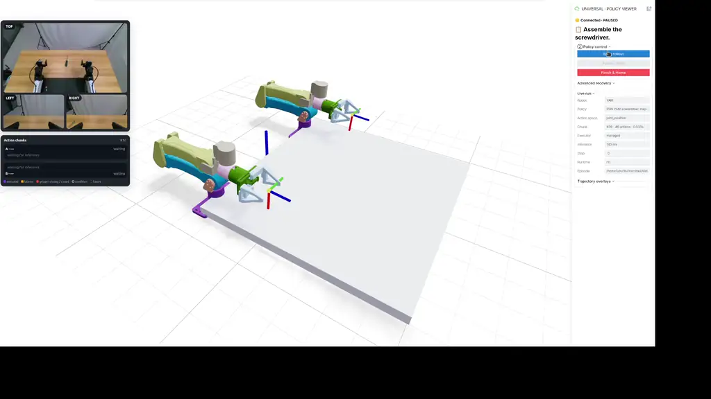
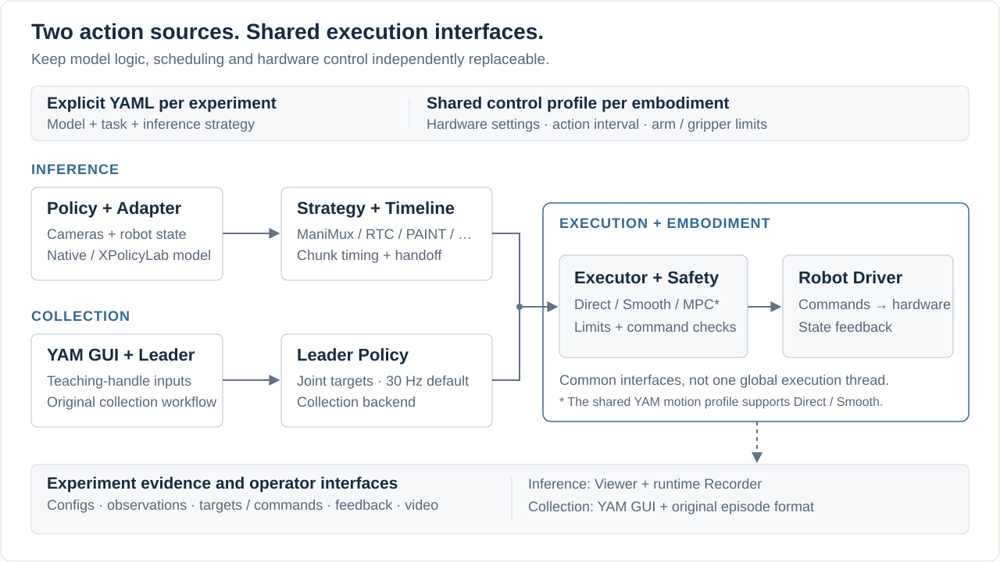

# ManiMux
### Composable Inference and Experiments for Real Robots

**Swap the policy and inference strategy—not your robot control stack.**

 

 

 

[English](README.md) · [简体中文](README.zh-CN.md)

[**Features**](#features) · [**Demo**](#demo) · [**Architecture**](#architecture) · [**Guideline**](docs/guideline.md) · [**Documentation**](docs/README.md)

> **Start here:** the [Guideline](docs/guideline.md) covers installation, a hardware-free demo,
> YAM collection and paired model-server / runtime commands. The README focuses on what ManiMux provides.

## Overview

Deploying a policy is more than calling a model. Inference latency, stale observations, chunk
handoffs and controller settings all affect what a robot actually executes—and make results hard
to compare when every method ships its own deployment stack.

**ManiMux separates policy inference, chunk scheduling, execution and embodiment-specific control.**
Compose an experiment from explicit configs, operate it through a shared Viewer, and keep the
actions, feedback and video needed to understand its behavior.

**Any Policy × Embodiment × Inference** is the design goal, not a claim of zero-effort compatibility.
Real-robot development currently centers on dual YAM; each new combination still needs a matching
action contract, adapter and validation.
Badge counts describe integration coverage, including model-only and simulation paths;
see the [counting rules](docs/README.md#support-counts), not a claim that every combination is deployable.

## Features

- **Composable deployment.** Reuse the runtime while changing the policy, inference strategy,
  executor or robot adapter; keep model-specific preprocessing and sampling in the model integration.
- **Interchangeable inference strategies.** Compare asynchronous ManiMux, serial execution, RTC,
  PAINT, temporal ensembling and adaptive chunking through the same execution interfaces.
  Backend requirements and validation status are documented per method.
- **Robo GUI for experiments.** Prepare, start, pause and finish rollouts from one interface,
  with live cameras, a 3D robot view and trajectory overlays.
- **Action-chunk visualization.** Inspect inference progress, executed steps, latency trimming,
  chunk handoffs, RTC condition links and gripper-closing targets as the run unfolds.
- **Structured human feedback.** Separate normal runs from experiments; attach task outcomes,
  smoothness ratings and failure tags before advancing to the next experiment.
- **Recorded execution evidence.** Save resolved configs, timestamped observations, predicted
  actions, executor commands, robot feedback, events and video for comparison and failure analysis.
- **Leader-policy data collection.** Keep the familiar YAM collection GUI and episode layout,
  while routing follower commands through ManiMux. Default collection is synchronous 30 Hz.
- **Shared collection / inference controls.** Explicit embodiment profiles align hardware settings,
  action-point timing and arm / gripper motion limits without forcing the same executor or filter.
- **Offline video evaluation.** Connect recorded rollouts to PRM-as-a-Judge for process-level
  analysis alongside human labels; judge inference stays outside the robot control loop.

### Collection roadmap

Teleoperation is available through the YAM collection GUI. **UMI collection** and
**DAgger-style intervention collection** are planned extensions, not implemented entry points yet.
The LLM-judge badge refers to the offline model-judge integration through PRM-as-a-Judge.

## Demo

*One rollout view: observe the scene, inspect chunk switching, and control the experiment.*

## Architecture

- **Inference path:** observations → policy / adapter → strategy / timeline → executor → robot driver.
  The policy produces actions; it does not command hardware directly.
- **Collection path:** YAM GUI → leader policy → collection backend → executor → robot driver.
  Collection does not start a model server or pass through a chunk-inference scheduler.
- **Shared contracts, distinct workflows:** selected configs reuse one control profile.
  Inference keeps the Viewer and runtime Recorder; collection keeps its own GUI and episode format.

See [Architecture](docs/architecture.md) for interfaces and
[YAM collection](docs/yam-collection.md) for the synchronous / threaded execution boundary.

## Explore

- **Run:** [Guideline](docs/guideline.md) · [Configuration reference](configs/README.md).
- **Models:** [Deployment runbooks](docs/README.md#policies-and-deployment), including Pi05,
  MolmoAct2, ABC, GR00T, LingBot-VLA2, Xiaomi XR-1, OpenWAM and SAPolicy integrations.
- **Methods:** [Inference and execution](docs/README.md#inference-and-execution).
- **Experiments:** [Viewer tutorial](docs/viewer-tutorial.html) · [Experiment workflow](docs/experiment-infra.md)
  · [PRM-as-a-Judge](docs/prm-as-a-judge.md).
- **Extend:** [Architecture contracts](docs/architecture.md) · [Full documentation index](docs/README.md).

## Safety and Attribution

ManiMux controls physical robots. Software tests and a working deployment do not establish
hardware safety or task success. Check the selected config and model contract, keep a physical
emergency stop available, and follow the relevant hardware runbook. Gripper target visualization
is not a sensor-based grasp-success detector.

See [THIRD_PARTY_NOTICES.md](THIRD_PARTY_NOTICES.md) and [licenses/](licenses) for upstream attribution.
