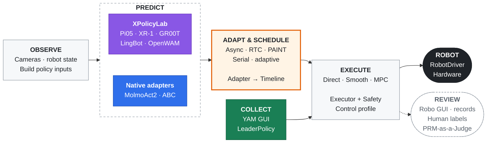

<div align="center">

# ManiMux
**A composable platform for real-robot experiments.**

Any Policy × Embodiment × Inference

[](#features)
[](docs/viewer-tutorial.html)
<br/>
[](XPolicyLab/)
[](PRM-as-a-Judge/)
[](pyproject.toml)
<br/>
[](docs/README.md#support-counts)
[](docs/README.md#support-counts)
[](docs/README.md#support-counts)
<br/>
[](docs/README.md#collection-status)
[](docs/prm-as-a-judge.md)

[English](README.md) · [简体中文](README.zh-CN.md)

[**Features**](#features) · [**Video**](#demo) · [**Architecture**](#architecture) · [**Quick Start**](#quick-start) · [**Documentation**](docs/README.md) · [**Citation**](#citation)

</div>

**ManiMux is a real-robot experiment platform for data collection, policy deployment and evaluation.**
Changing a policy should not mean rebuilding the robot control stack. ManiMux separates
**what to predict, when to execute, and how to control the hardware**, so models and chunking
methods can be compared through a consistent experiment workflow.

Collect demonstrations with a leader policy, run learned policies through configurable executors,
and inspect camera streams, trajectories and chunk handoffs in Robo GUI. Episode records connect
model predictions to issued commands and robot feedback, with human labels and offline judging
for evaluation. **XPolicyLab** provides policy integrations; **PRM-as-a-Judge** provides offline evaluation.

> 📖 Start with the [Guideline](docs/guideline.md) for installation and setup, or use the [Pi05 example](#quick-start) below. Detailed model and method guides live in [Documentation](docs/README.md).

## News

- **[2026-09-12]** YAM teleoperation collection now runs through ManiMux, with shared collection / inference control profiles. [Details](docs/yam-collection.md) · [Change](https://github.com/SII-LiuLab/manimux/commit/9d14670)

<a id="features"></a>

## ✨ Features

| Feature | Status | What it provides |
|---|:---:|---|
| Composable deployment | ✅ | Policy × inference strategy × executor × embodiment |
| Inference methods | ✅ | Async, serial, RTC, PAINT and adaptive chunking |
| Robo GUI | ✅ | Rollout controls, cameras, 3D state, trajectories and chunk timelines |
| Teleop collection | ✅ | Leader policy + YAM GUI, with ManiMux follower control |
| Shared control profiles | ✅ | Common hardware settings, action timing and arm / gripper limits |
| Execution evidence | ✅ | Configs, observations, actions, commands, feedback, events and video |
| Evaluation | ✅ | Human labels + offline PRM / LLM judging |
| UMI / DAgger collection | — | [Collection roadmap](docs/README.md#collection-status) |

✅ denotes implemented functionality, not validation of every model / hardware combination.
[Support counts](docs/README.md#support-counts) also include model-only and simulation paths.

<a id="demo"></a>

## 🎬 Demo Video

Dual-arm YAM rollout with live cameras, 3D robot state and action-chunk handoffs.


[**▶ Open the MP4 recording**](assets/manimux_2026-09-05_23-17-35-00.00.03.144-00.00.34.914-seg1-00.00.02.596-00.00.34.966.mp4)

<a id="architecture"></a>

## 🧩 Architecture

**Policy inference and hardware execution are separate responsibilities.** The inference strategy
decides when and how to hand off a chunk; the executor turns its targets into robot commands.



Model servers never command hardware. Teleoperation bypasses chunk scheduling and reuses the
execution interfaces, while retaining its own collection GUI and recording format.

**GitHub:** [ManiMux](https://github.com/SII-LiuLab/manimux) · [XPolicyLab](https://github.com/Cuzyoung/XPolicyLab) · [PRM-as-a-Judge](https://github.com/YuyangLiu2003/PRM-as-a-Judge)

<a id="quick-start"></a>

## 🚀 Quick Start · Pi05 on YAM

This example runs **Pi05 pure-joint, step-30000, put-bottles with RTC**. It assumes the YAM and
OpenPI environments, checkpoint and local device configuration are already prepared;
see the [setup guide](docs/guideline.md#pi05-30k-on-yam). For a hardware-free first run, use the
[mock example](docs/guideline.md#hardware-free-start).

From the repository root, run these in **four separate terminals**. Reuse matching camera / Viewer
services if already running; collection and inference must not control the same robot simultaneously.

```bash
# Terminal 1: cameras
envs/yam/.venv/bin/manimux-camera-server --config configs/cameras.yaml

# Terminal 2: Viewer
envs/yam/.venv/bin/manimux-viewer --robot yam --host 127.0.0.1 --port 8086

# Terminal 3: pure-joint 30k model server
XPolicyLab/policy/Pi_05/openpi/.venv/bin/python \
  scripts/servers/pi05_yam_server.py \
  --config configs/pi05/yam/server/put-bottles/joint-step30000.yaml

# Terminal 4: matching RTC runtime
envs/yam/.venv/bin/manimux serve \
  --config configs/pi05/yam/infra/put-bottles/rtc-joint-step30000.yaml
```

Open **http://127.0.0.1:8086**, then **Prepare → Start rollout → Finish & Home**.
Normal rollouts need no label; experiment rollouts require a human label before the next trial.
Keep the server and runtime configs paired: this example uses **joint**, not **joint+EE**.

## 📚 Guides

- **Run:** [Guideline](docs/guideline.md) · [Configuration](configs/README.md).
- **Integrate:** [Components and policy runbooks](docs/README.md) · [Inference methods](docs/README.md#inference-and-execution).
- **Collect / evaluate:** [YAM collection](docs/yam-collection.md) · [Experiment workflow](docs/experiment-infra.md) · [PRM guide](docs/prm-as-a-judge.md).
- **Extend:** [Architecture contracts](docs/architecture.md).

<a id="citation"></a>

## 📝 Citation

If ManiMux supports your experiments, please cite the repository. For experiments using its
XPolicyLab integration, please also cite the [XPolicyLab paper](https://arxiv.org/abs/2608.09892).

```bibtex
@misc{manimux2026,
  title = {{ManiMux}: A Composable Platform for Real-Robot Experiments},
  year = {2026},
  howpublished = {GitHub repository},
  url = {https://github.com/SII-LiuLab/manimux}
}

@article{community2026xpolicylab,
  title = {{XPolicyLab}: A Unified Standard and Open Ecosystem for Robot Policy Evaluation and Deployment},
  author = {{XPolicyLab Community} and Chen, Tianxing and Chen, Yue and Nian, Tian and others},
  journal = {arXiv preprint arXiv:2608.09892},
  year = {2026},
  doi = {10.48550/arXiv.2608.09892},
  url = {https://arxiv.org/abs/2608.09892}
}
```

---

Physical robots require matching model contracts and hardware safety measures; software checks do not certify safety or task success.
Upstream attribution: [notices](THIRD_PARTY_NOTICES.md) · [licenses](licenses).
