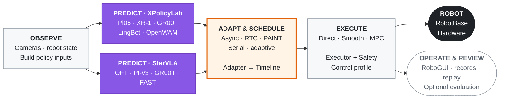

<div align="center">

<p></p>

**Any embodiment. Any policy. Any inference strategy.**

ManiMux is an **extensible real-world manipulation harness** that **standardizes**
deployment and experiment workflows across embodiments, policies, and inference strategies.
Built around **RoboGUI**, it brings together **live digital twin visualization**
and a runtime designed for **100–200 Hz command execution**.

**Policy × Runtime × Embodiment**

[](https://sii-liulab.github.io/manimux/)
[](https://sii-liulab.github.io/manimux/#manimux)
[](.agents/skills/manimux-development/SKILL.md)

[](#included-integrations)
[](#included-integrations)
[](#included-integrations)
[](https://github.com/SII-LiuLab/manimux/commits/main/)

[English](README.md) · [简体中文](README.zh-CN.md)

[Quick start](#quick-start) · [Architecture](#architecture) · [Integrate](#integrate) · [Documentation](https://sii-liulab.github.io/manimux/) · [Citation](#citation)

</div>

> **[Read the ManiMux Guide →](https://sii-liulab.github.io/manimux/) · [Markdown source](docs/index.md)**
> Installation, station setup, deployment recipes, RoboGUI workflows and integration protocols.
> For agent-led development, start with the [development skill](.agents/skills/manimux-development/SKILL.md).

## News

- **2026-10-02** — Added [ALOHA-AgileX](docs/usage/aloha.md) and [PiPER](docs/usage/piper.md) RoboGUI demos, plus experimental [ARX X5 / PiPER controllers](docs/usage/can-arms.md). Hardware validation is pending.
- **2026-10-01** — The [ManiMux Guide](https://sii-liulab.github.io/manimux/) is live, covering setup, deployment, RoboGUI and integration protocols.
- **2026-10-01** — Updated [research workflows](docs/usage/research.md) and [agent integration guides](docs/development/README.md) for free exploration, study templates and component development.

## RoboGUI


[▶ Watch the real-robot demo](assets/manimux_2026-09-05_23-17-35-00.00.03.144-00.00.34.914-seg1-00.00.02.596-00.00.34.966.mp4)

**Prepare → Start → Pause / Finish → Review.** Free rollouts need no scoring.
Study rollouts can use a template and optional evaluation. Recorded trajectories replay
in a separate, hardware-free view. [Research workflow →](docs/usage/research.md)

## Included integrations

- **Policies with robot deployment recipes (9):** Pi05, DP, SAPolicy, ABC-DiT, GR00T N1.7, LingBot-VLA2, Xiaomi XR-1, UMI DP and OpenWAM.
- **Policies with offline recipes (5):** Isaac 0.5 and StarVLA's QwenOFT, QwenPI-v3, QwenGR00T and QwenFast.
- **Base inference modes (8), plus opt-in combinations:** Serial, asynchronous chunking, RTC, ACT temporal ensembling, AAC, PAINT, AutoHorizon and BID backward-only.
- **Hardware integrations (4):** YAM, Tianji–TacCap, and experimental ARX X5 / PiPER. **Executors:** Direct, Smooth and MPC.

[ALOHA-AgileX follower-arm assets](docs/usage/aloha.md) and
[standard PiPER assets](docs/usage/piper.md) are available for offline RoboGUI
preview and replay. Experimental [ARX X5 / PiPER SDK adapters](docs/usage/can-arms.md)
include station templates and offline validation; physical deployment remains unvalidated.
The [SDK installation guide](docs/usage/robot-sdks.md) covers their external dependencies.

Policy serving uses **XPolicyLab** or **StarVLA**. Counts describe included integrations,
not all model × method × robot combinations or completed hardware validation.
See the [support catalog](docs/usage/deployments.md#integration-counts) for scope and recipes.
Evaluation is optional; choose your own research protocol and metrics.

## Inference strategies and combinations

Choose a base algorithm, a request schedule, and optional ACT fusion. The eight base
modes remain available; combinations reuse their existing samplers and do not require
changes to XPolicyLab or model weights.

| Purpose | Modes | Behavior |
| --- | --- | --- |
| Execution scheduling | Serial, asynchronous chunking | Infer after the selected prefix finishes, or overlap inference with execution |
| Consistency between chunks | RTC, PAINT, ACT temporal ensembling, BID backward-only | Guide sampling, adjust initial noise, average aligned predictions, or select a coherent candidate |
| Adaptive execution length | AAC, AutoHorizon | Select a source prefix using candidate uncertainty/motion or action attention |

The current compatibility matrix is:

| Base algorithm | Serial | Async `single_inflight` | Async `multi_inflight` | Optional ACT fusion |
| --- | --- | --- | --- | --- |
| Ordinary chunking (`manimux`) | Yes | Yes | Yes | Select `act_temporal_ensemble` |
| ACT temporal ensembling | **New** | Yes | Yes | Already enabled |
| RTC | — | Yes | Yes | **New** |
| PAINT | — | Yes | **New** | **New** |
| BID backward-only | Yes | Yes | Yes | **New** |
| AAC | Yes | **New** | **New** | **New** |
| AutoHorizon | Yes | **New** | **New** | **New** |

**BID + AAC adaptive horizon** is available under
`algorithm: bid_backward` with `bid.execution_horizon: aac`: one candidate batch
supplies AAC's execution length and BID's candidate selection. It supports serial,
single-inflight, deadline and multi-inflight execution, and optional ACT fusion. This is separate
from AAC's existing `aac.chunk_id_selector: backward`, which compares candidate batches
in normalized end-effector motion space.

**ACT + serial** uses `chunk_policy_steps` as its execution horizon:

```yaml
inference:
  algorithm: act_temporal_ensemble
  inference_schedule: serial
  chunk_policy_steps: 5
  action_start_mode: first_step_when_ready
  blend_policy_steps: 0
```

It retains full predictions for fusion, executes five policy steps, then requests
the next chunk. Fusion aligns predictions by their actual commit times, including
the inference gap and fractional action intervals. No valid overlap means the new
prediction is used alone. Omitting `chunk_policy_steps` executes the full chunk.
The asynchronous ACT query interval is unchanged and does not control serial execution.

For example, in a Pi05 experiment under `configs/experiments/put_bottles/pi05/`:

```yaml
inference:
  config: ../../../inference/yam_autohorizon_multi_inflight.yaml
  temporal_ensemble:
    enabled: true       # AutoHorizon + asynchronous requests + ACT fusion
```

```yaml
inference:
  config: ../../../inference/yam_bid_aac.yaml  # Serial BID + AAC execution length
  # Optional: temporal_ensemble: {enabled: true}
```

New selecting presets are `yam_{aac,autohorizon}_{single_inflight,multi_inflight}.yaml`,
`yam_paint_multi_inflight.yaml`, `yam_bid_aac.yaml`, and `yam_act_serial.yaml` in
[the inference config directory](manimux/configs/inference/README.md).
To add ACT to RTC, PAINT or BID, retain that algorithm/preset, set
`temporal_ensemble.enabled: true`, and use `blend_policy_steps: 0`.
The base algorithm retains its request cadence; ACT's standalone query interval does
not override it. Serial ensembles may have no valid overlap.

- `single_inflight` allows one outstanding request. `multi_inflight` uploads at an
  explicit `observation_hz`; the server keeps the latest waiting observation and runs
  one model call at a time. `request_trigger` separately chooses refill or continuous
  requests for ordinary/BID/AAC/AutoHorizon paths.
- Legacy `deadline` remains actual deadline scheduling for ordinary chunking and BID.
  For RTC/PAINT/ACT it resolves to single-inflight; for AAC/AutoHorizon it resolves to
  serial, preserving existing presets.
- Adaptive asynchronous horizons use `drop_infer_latency`: expired rows consume the
  selected source prefix. A reply with no eligible future rows is rejected. Execution
  does not extend past the selected prefix to compensate for delay.
- RTC/PAINT streaming rejects results based on replaced reference plans. With ACT,
  the next condition uses the accepted fused plan. The new RTC/PAINT combinations
  sample conditioning targets at the observation's exact timestamps. BID retains its selected, unfused
  prediction for its own scoring history. Rejected replies never enter new combination
  histories.
- New combinations require inline, complete absolute-joint decoding (`JointAdapter`
  family), zero extra blending/skip for ACT and adaptive async, and the backend's real
  sampling capabilities. AAC composition uses the ManiMux XPolicyLab client and needs
  appropriate EE statistics. Existing serial AAC/AutoHorizon and asynchronous ACT keep
  their original paths. The new combinations are offline-tested adaptations, not claims
  of improved task success or completed real-model/robot validation.

RTC + PAINT, conditioned multi-candidate sampling, and AutoHorizon attention combined
with another sampler remain unsupported. See [timing and composition contracts](docs/advanced/inference.md).

## Architecture

Model frameworks own inference. ManiMux owns observation/action adaptation, scheduling,
execution and experiment operation. Strategies decide when to request and hand off chunks;
executors turn timeline references into commands.


```mermaid
%%{init: {"flowchart": {"wrappingWidth": 180, "curve": "basis", "nodeSpacing": 24, "rankSpacing": 28, "padding": 14}}}%%
flowchart LR
    OBS["<b>OBSERVE</b><br/>Cameras · robot state<br/>Build policy inputs"]:::stage

    XPOLICY["<b>PREDICT · XPolicyLab</b><br/>Pi05 · XR-1 · GR00T<br/>LingBot · OpenWAM"]:::xpolicy

    STARVLA["<b>PREDICT · StarVLA</b><br/>OFT · PI-v3 · GR00T · FAST"]:::xpolicy

    PLAN["<b>ADAPT & SCHEDULE</b><br/>Async · RTC · PAINT<br/>Serial · adaptive<br/><br/>Adapter → Timeline"]:::handoff
    ACT["<b>EXECUTE</b><br/>Direct · Smooth · MPC<br/><br/>Executor + Safety<br/>Control profile"]:::stage
    ROBOT(["<b>ROBOT</b><br/>RobotBase<br/>Hardware"]):::robot
    REVIEW(["<b>OPERATE & REVIEW</b><br/>RoboGUI · records · replay<br/>Optional evaluation"]):::side

    OBS --> XPOLICY --> PLAN --> ACT --> ROBOT
    OBS --> STARVLA --> PLAN
    ACT -.-> REVIEW

    classDef stage fill:#F6F8FA,stroke:#8C959F,stroke-width:1px,color:#1F2328
    classDef handoff fill:#FFF4E5,stroke:#E36209,stroke-width:2.5px,color:#1F2328
    classDef side fill:#FFFFFF,stroke:#8C959F,stroke-dasharray:4 3,color:#57606A
    classDef robot fill:#1F2328,stroke:#1F2328,color:#FFFFFF
    classDef xpolicy fill:#8957E5,stroke:#6633B8,color:#FFFFFF
```

XPolicyLab and StarVLA have independent serving environments and ManiMux clients.
A new framework can implement the same client interface. A new robot implements component
and assembly protocols. [Extension map →](docs/development/README.md)

## Quick start

### Explore without hardware

Python 3.11 or 3.12 and [uv](https://docs.astral.sh/uv/) are required for these commands:

```bash
git clone https://github.com/SII-LiuLab/manimux.git
cd manimux
uv sync --dev
uv run manimux-robogui --robot yam --demo --host 127.0.0.1 --port 8086
```

Open **http://127.0.0.1:8086**. This demo displays synthetic data and the bundled YAM
model; it does not connect to a robot. Model-framework submodules and checkpoints are
only needed for the deployment path you choose.

Try the new arms in RoboGUI using the same environment:

```bash
uv run manimux-robogui --robot piper --demo --host 127.0.0.1 --port 8087
```

Open **http://127.0.0.1:8087**. Use `--robot aloha` for ALOHA-AgileX.
Both presets animate arms and grippers with synthetic data; no device SDK is needed.
ARX X5 currently has a kinematic model and experimental controller, without a
bundled RoboGUI mesh preset.

Upgrading an existing checkout? See the [RoboGUI interface migration](docs/usage/getting-started.md#updating-older-installations).

### Run on your robot

1. Select a [model/robot runbook](docs/usage/deployments.md)
   and prepare its hardware and model environments.
2. Bind devices, service addresses and checkpoint paths in your private
   [station file](docs/usage/station.md).
3. Start the camera, RoboGUI, model server and runtime using the
   [complete Pi05/YAM example](docs/usage/getting-started.md#pi05-30k-on-yam)
   or the selected model's runbook.
4. Continue in RoboGUI: enter your task, prepare and run trials, then review records.

`manimux serve` keeps the service available for repeated GUI-driven rollouts.
`manimux run` executes one rollout. Preparation can connect and move the selected robot
as configured; use the runbook matching your actual setup.

[Configuration explained](manimux/configs/README.md) · [Annotated experiment](manimux/configs/examples/README.md)

## Integrate

**For users:** configure an existing combination and use RoboGUI.
**For your coding agent:** use the [development skill](.agents/skills/manimux-development/SKILL.md)
or the matching task skill below. If your tool does not discover repository skills,
ask it to read the linked `SKILL.md` explicitly.

| Task | Entry point |
| --- | --- |
| Add a robot, gripper or camera | [Component protocols](docs/development/components.md) |
| Add a model, framework or action adapter | [Policy protocols](docs/development/policies.md) |
| Add scheduling, execution or a GUI feature | [Runtime protocols](docs/development/runtime-config.md) |
| Connect supported hardware at another lab | [Station setup skill](.agents/skills/manimux-station-setup/SKILL.md) |
| Analyze your recorded experiments | [Experiment skill](.agents/skills/manimux-experiments/SKILL.md) |

Each integration documents its input/output semantics, owning files, YAML selection and
validation.

**Build with us.** Contributions are welcome—from new embodiments, policies, and
inference strategies to documentation and bug fixes. Start with the
[integration guide](docs/development/README.md), follow the shared protocols, and see
[Contributing](docs/development/README.md#contributing) for the expected handoff.

## Support and evidence

See the [support catalog](docs/usage/deployments.md) for model, hardware and method
runbooks. Capabilities vary by checkpoint and backend; an integration does not imply
that every model × robot × algorithm combination has been tested on hardware.
ManiMux is under active development. Each deployment guide states its validation scope.

## Citation

If ManiMux supports your research, please cite:

**ManiMux: An Extensible Real-World Manipulation Harness**

```bibtex
@misc{manimux2026,
  title = {{ManiMux}: An Extensible Real-World Manipulation Harness},
  year = {2026},
  howpublished = {GitHub repository},
  url = {https://github.com/SII-LiuLab/manimux}
}
```

Please also cite the components, models and methods used in your work:
[XPolicyLab](https://github.com/XPolicyLab/XPolicyLab), [StarVLA](https://github.com/starVLA/starVLA) and [PRM-as-a-Judge](https://github.com/YuyangLiu2003/PRM-as-a-Judge).

<details>
<summary>Official BibTeX for related projects (cite those you use)</summary>

[XPolicyLab](https://arxiv.org/abs/2608.09892)

```bibtex
@article{community2026xpolicylab,
  title={{XPolicyLab}: A Unified Standard and Open Ecosystem for Robot Policy Evaluation and Deployment},
  author={Community, XPolicyLab and Chen, Tianxing and Chen, Yue and Nian, Tian and Cai, Zijian and Chen, Guangyu and Lin, Wenwei and Liang, Qiwei and Xiang, Peicheng and Su, Kailun and others},
  journal={arXiv preprint arXiv:2608.09892},
  year={2026}
}
```

[StarVLA](https://arxiv.org/abs/2604.05014)

```bibtex
@article{community2026starvla,
  title={StarVLA: A Lego-like Codebase for Vision-Language-Action Model Developing},
  author={Community, StarVLA},
  journal={arXiv preprint arXiv:2604.05014},
  year={2026},
  eprint={2604.05014},
  archivePrefix={arXiv},
  primaryClass={cs.RO}
}
```

[PRM-as-a-Judge 1.5 — toolkit report](https://arxiv.org/pdf/2608.14284)

```bibtex
@article{liu2026prmjudge15,
  title   = {PRM-as-a-Judge 1.5: A Toolkit for Robot Process Assessment},
  author  = {Liu, Yuyang and Shen, Yanqing and Chen, Ruike and Zhao, Jifan and Tian, Yuxuan and Zhang, Yichi and Long, Tianfeng and Yin, Zixuan and Wang, Yipu and Qin, Ziheng and Tan, Wenxing and Shi, Yang and Cao, Mingyu and Xiao, Runze and Wang, Ziqi and Yin, Zhixin and Chu, Shiwei and Zhang, Yi-Fan and Mu, Yao and Ji, Yuheng and Wang, Yihao and Yan, Jun and Wang, Zhongyuan and Wang, Pengwei and Zheng, Xiaolong},
  journal = {arXiv preprint arXiv:2608.14284},
  year    = {2026},
  url     = {https://arxiv.org/pdf/2608.14284}
}
```

[PRM-as-a-Judge — original method](https://arxiv.org/abs/2603.21669)

```bibtex
@article{ji2026prmjudge,
  title   = {PRM-as-a-Judge: A Dense Evaluation Paradigm for Fine-Grained Robotic Auditing},
  author  = {Ji, Yuheng and Liu, Yuyang and Tan, Huajie and Huang, Xuchuan and Huang, Fanding and Xu, Yijie and Chi, Cheng and Zhao, Yuting and Lyu, Huaihai and Co, Peterson and others},
  journal = {arXiv preprint arXiv:2603.21669},
  year    = {2026}
}
```

</details>

[Third-party notices](licenses/THIRD_PARTY_NOTICES.md) · [Upstream licenses](licenses) · [Documentation](https://sii-liulab.github.io/manimux/)

## License

[](pyproject.toml)
[](LICENSE)

ManiMux is licensed under [MIT](LICENSE). Third-party frameworks, SDKs and assets
retain their own licenses; see [third-party notices](licenses/THIRD_PARTY_NOTICES.md).
