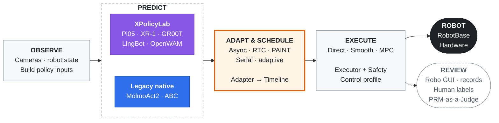

<div align="center">

# ManiMux
**统一控制底座，自由组合策略、推理与本体的真机实验平台。**

Policy × Runtime × Embodiment

[](#features)
[](docs/viewer-tutorial.html)
<br/>
[](XPolicyLab/)
[](PRM-as-a-Judge/)
[](pyproject.toml)
<br/>
[](docs/README.md#support-counts)
[](docs/README.md#support-counts)
[](docs/README.md#support-counts)
<br/>
[](docs/prm-as-a-judge.md)

[English](README.md) · [简体中文](README.zh-CN.md)

[**Features**](#features) · [**视频**](#demo) · [**架构**](#architecture) · [**快速启动**](#quick-start) · [**文档**](docs/README.md) · [**引用**](#citation)

</div>

**ManiMux 将策略部署与评测放在同一套真机控制底座上。**
换模型、换算法、换本体，不必从头搭建部署流程：通过配置组合 **Policy、Runtime 策略、
Executor 与本体**。标准接口分离模型推理与硬件控制，让接入能力跨本体复用，
而不是为每个“模型 × 机器人”单独维护一套代码。

**用 Robo GUI 管理实验，看清每一步执行。** 从准备、启动 rollout，到实时相机、3D 状态、
轨迹与 chunk 切换，再到回看模型预测、下发命令和机器人反馈，形成统一的实验流程。
**XPolicyLab** 负责模型接入，人工标注与 **PRM-as-a-Judge** 支持实验记录的评测。

**范围：** ManiMux 负责策略部署、运行记录、回放与评测；遥操作和示范数采不再放在本仓库。

> 📖 想把自己的 YAM 或 Tianji–TacCap 接到 ManiMux？第一步看[本地工位接入](manimux/configs/local/README.md)。安装与启动见[使用指南](docs/guideline.md)，模型、算法与接口细节见[文档索引](docs/README.md)。

## 第一步：接入自己的同型号真机

同型号机器人复用现有组件实现。用户和 agent 都从[本地工位接入说明](manimux/configs/local/README.md)开始：

1. 选择 [YAM](manimux/configs/local/yam.example.yaml) 或
   [Tianji–TacCap](manimux/configs/local/tianji_taccap.example.yaml) 模板，复制到 `manimux/configs/local/station.yaml`。
2. 填写本机 CAN 接口、控制器 IP、设备序列号和服务地址。`can_left` 是开发工位的
   Linux 接口名；自己的机器叫 `can0` 就填 `can0`。组件名保持与本体装配一致。
3. 按说明只读取合并后的配置，再进入对应本体和模型的运行手册。
   设备绑定与实验的动作格式、控制频率、执行开关分别管理。

实际工位文件由 Git 忽略，不随安装包发布。runtime 启动，以及相机、Pi05 和 UMI_DP
的 `--experiment` 入口会默认读取它；只有切换另一套工位时才需要传 `--local <路径>`。
Viewer 的网络选项和其他模型启动器仍有独立入口，具体范围见
[本地工位说明](manimux/configs/local/README.md#scope-and-remaining-independent-entry-points)。
通用 README 和新增代码注释使用英文，本页保留中文。

## News

- **[2026-09-13] Initial 版本正在开发。** 正在完善可组合的策略部署与 GUI 实验管理，共用统一的真机控制底座。

<a id="features"></a>

## ✨ Features

| 功能 | 状态 | 提供什么 |
|---|:---:|---|
| 组合式部署 | ✅ | 配置驱动 Policy × Runtime 策略 × Executor × 本体 |
| 跨本体接口 | ✅ | 统一契约；按组件装配真实本体 |
| 可插拔推理 | ✅ | 异步、串行、RTC、PAINT 与自适应 chunking |
| Robo GUI | ✅ | 实验控制、相机、3D 状态、轨迹和 chunk 时间线 |
| 执行记录 | ✅ | 配置、观测、预测动作、下发命令、反馈、事件和视频 |
| 实验评测 | ✅ | 人工标注 + 离线 PRM / LLM Judge |

✅ 表示已有实现，不代表所有模型 / 本体组合均已验证。
[接入数量](docs/README.md#support-counts)也包含仅模型路径。

<a id="demo"></a>

## 🎬 演示视频

双臂 YAM 真机 rollout：实时相机、3D 机器人状态与 action-chunk 切换。


[**▶ 打开 MP4 录屏**](assets/manimux_2026-09-05_23-17-35-00.00.03.144-00.00.34.914-seg1-00.00.02.596-00.00.34.966.mp4)

<a id="architecture"></a>

## 🧩 架构

**模型推理与硬件执行各司其职。** 推理策略决定何时生成、如何接续 chunk；
Executor 将目标动作变成机器人命令。



模型 server 不直接控制硬件。ManiMux 保留推理运行记录和离线回放。
新模型必须走 [XPolicyLab 统一接入路径](AGENTS.md#model-integration-xpolicylab-only)；
图中的 native 仅为迁移前保留的兼容入口。

**GitHub：**[ManiMux](https://github.com/SII-LiuLab/manimux) · [XPolicyLab](https://github.com/Cuzyoung/XPolicyLab) · [PRM-as-a-Judge](https://github.com/YuyangLiu2003/PRM-as-a-Judge)

<a id="quick-start"></a>

## 🚀 快速启动 · Pi05 on YAM

以下示例使用 **Pi05 纯 joint、step-30000、放瓶子任务与 RTC**。
需要先准备好 YAM / OpenPI 环境、checkpoint 和本机设备配置，见[环境指南](docs/guideline.md#pi05-30k-on-yam)。
没有硬件可先运行 [Viewer 演示](docs/guideline.md#hardware-free-start)。

先完成[本地工位接入](manimux/configs/local/README.md)。下列相机、Pi05 和 runtime 命令
使用同一份实验配置，并默认读取同一份 local。该 RTC 配方的下发频率为 **30 Hz**，
模型动作点间隔为 **1/30 秒**。

从仓库根目录，在**四个独立终端**运行。已有匹配的相机或 Viewer 服务时可复用；
数采与推理不要同时控制同一个机器人。

```bash
# Terminal 1: cameras
envs/yam/.venv/bin/python -m manimux.servers.camera.server \
  --experiment manimux/configs/experiments/put_bottles/pi05/yam_pi05_rtc_joint_step30000.yaml

# Terminal 2: Viewer
envs/yam/.venv/bin/python -m manimux.viewer.dashboard --robot yam --host 127.0.0.1 --port 8086

# Terminal 3: pure-joint 30k model server
XPolicyLab/policy/Pi_05/openpi/.venv/bin/python \
  -m manimux.servers.pi05 \
  --experiment manimux/configs/experiments/put_bottles/pi05/yam_pi05_rtc_joint_step30000.yaml

# Terminal 4: matching RTC runtime
envs/yam/.venv/bin/python -m manimux serve \
  --config manimux/configs/experiments/put_bottles/pi05/yam_pi05_rtc_joint_step30000.yaml
```

打开 **http://127.0.0.1:8086**，按 **Prepare → Start rollout → Finish & Home** 操作。
正常 rollout 不强制打分，实验 rollout 需人工标注后再进入下一条。
server 与 runtime 的配置必须配套：这里是 **joint**，不是 **joint+EE**。

## 📚 使用指南

- **开始运行：**[完整指南](docs/guideline.md) · [配置说明](manimux/configs/README.md)。
- **模型与算法：**[组件和模型手册](docs/README.md) · [推理方法](docs/README.md#inference-and-execution)。
- **评测：**[实验流程](docs/experiment-infra.md) · [PRM 评测](docs/prm-as-a-judge.md)。
- **扩展开发：**[架构与接口](docs/architecture.md)。

<a id="citation"></a>

## 📝 引用

如果 ManiMux 帮助了你的实验，欢迎引用本仓库。
使用 XPolicyLab 接入模型时，也请引用 [XPolicyLab 论文](https://arxiv.org/abs/2608.09892)。

```bibtex
@misc{manimux2026,
  title = {{ManiMux}: A Composable Platform for Real-Robot Experiments},
  year = {2026},
  howpublished = {GitHub repository},
  url = {https://github.com/SII-LiuLab/manimux}
}

@article{community2026xpolicylab,
  title = {{XPolicyLab}: A Unified Standard and Open Ecosystem for Robot Policy Evaluation and Deployment},
  author = {{XPolicyLab Community} and Chen, Tianxing and Chen, Yue and Nian, Tian and others},
  journal = {arXiv preprint arXiv:2608.09892},
  year = {2026},
  doi = {10.48550/arXiv.2608.09892},
  url = {https://arxiv.org/abs/2608.09892}
}
```

---

真机需要匹配的模型契约与硬件安全措施；软件检查不等于安全认证或任务成功。
上游来源：[声明](THIRD_PARTY_NOTICES.md) · [许可](licenses)。
