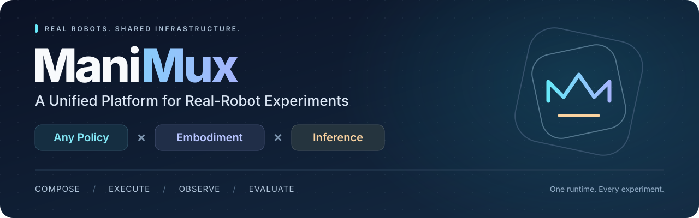
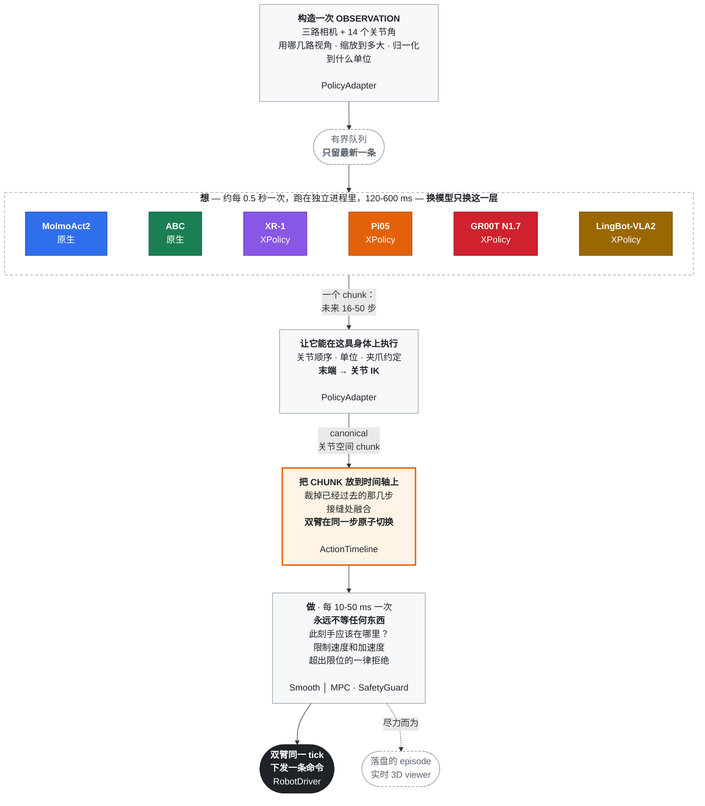

<div align="center">

<h1></h1>

## 统一真机实验管理平台

自由组合策略、机器人本体与推理算法。<br/>
在同一套框架中完成实验执行、实时可视化、数据记录与评测。

[](https://www.python.org/)
[](https://docs.astral.sh/ruff/)
[](https://mypy-lang.org/)
[](docs/molmoact-yam-runbook.md)
[](https://arxiv.org/abs/2506.07339)
[](https://github.com/SII-LiuLab/manimux/commits)

[English](README.md) · [简体中文](README.zh-CN.md)

**[快速开始](#10-分钟无硬件上手) · [已接入策略](#当前集成) · [推理算法](README.md#inference-algorithm-roadmap) · [Viewer](docs/viewer-tutorial.html) · [离线评测](#离线视频评测prm-as-a-judge) · [文档](#文档)**

</div>


<p align="center"><em>ManiMux 真机实验：实时相机画面、机器人可视化与 action-chunk 进度时间线。</em></p>

## 30 秒理解 ManiMux

**ManiMux 是以异步推理运行时为核心的统一真机实验管理平台。** 策略负责“接下来怎么动”，
ManiMux 负责“什么时候执行、如何平滑、安全地下发”，并记录完整实验过程，用于回看与评测。

| Policy · 策略 | Embodiment · 本体 | Inference · 推理 |
|---|---|---|
| 通过统一适配接口接入策略 | 通过本体适配器映射观测与动作 | 切换调度与采样算法，共用底层执行器 |

目标是让三者可以组合，而不是每换一个组合就重写一套部署系统。当前真机验证以双臂 YAM
为主；各组合的接入与验证状态见[当前集成](#当前集成)和[推理算法路线图](README.md#inference-algorithm-roadmap)。

```text
相机 + 机器人状态
        ↓
Policy / XPolicy 模型      生成未来 16～50 步 action chunk
        ↓
PolicyAdapter              转成当前机器人能执行的关节动作
        ↓
ManiMux Runtime            裁剪过期动作、拼接、平滑、安全检查
        ↓
Robot                      同一 control tick 原子下发双臂命令

同时输出：Recorder episode + 3D Viewer
```

先记住三件事：

1. **模型不直接控制机器人**，只返回一段未来动作。
2. **Adapter 负责翻译**，把 joint、EE pose 或 delta 统一成 canonical action chunk。
3. **ManiMux 负责执行**，控制频率、Timeline、Safety、Recorder 不随模型复制。

## 10 分钟无硬件上手

```bash
git clone --recursive https://github.com/SII-LiuLab/manimux.git
cd manimux
uv sync --dev
uv run manimux run --config configs/mock.yaml
```

`configs/mock.yaml` 使用假机器人、假相机和假 policy，但运行真实的 worker、Timeline、
SmoothExecutor、SafetyGuard 和 Recorder。默认执行 `120` 个 control tick，并在 `data/`
生成一个完整 episode；它不会连接相机、CAN 或真实机械臂。

独立查看 YAM Viewer 演示：

```bash
uv run manimux-viewer --robot yam --demo --port 8086
```

浏览器打开 `http://localhost:8086`。这个 `--demo` 是独立可视化演示，不是上述 mock
runtime 的实时画面。

### 做三个安全小实验

先复制配置，不改仓库基线：

```bash
cp configs/mock.yaml /tmp/manimux-beginner.yaml
```

然后每次只改一个值并重新运行：

| 修改 | 建议值 | 能观察什么 |
|---|---:|---|
| `run.max_steps` | `120 → 300` | control tick 与 episode 生命周期 |
| `policy.inference_delay_s` | `0.04 → 0.20` | 模型变慢时，控制环仍不阻塞 |
| `execution.blend_steps` | `0 / 2 / 8` | 新旧 action chunk 的接缝差异 |

第一份配置只需按七块理解：`run` 决定实验，`robot` 决定本体，`sensors` 决定观测，
`policy` 决定模型与 action chunk，`execution` 决定调度和执行，`viewer` 决定实时显示，
`recording` 描述记录策略（当前 runtime 默认始终记录）。逐字段说明见
[配置导读](configs/README.md#第一份配置configsmockyaml)。

## Beginner 先看哪里

| 路径 | 先把它理解成 |
|---|---|
| `configs/` | 实验入口：选择模型、本体、checkpoint 和 runtime |
| `docs/*-runbook.md` | 操作说明：每个模型如何安装、启动、检查和停止 |
| `src/manimux/` | 通用引擎：runtime、robot、sensor、safety、recording、viewer |
| `XPolicyLab/` | 模型内部：Pi05、GR00T、XR-1、LingBot 等 adapter 与 sampler |
| `data/` | 运行结果：resolved config、动作、状态、事件和 episode 结果 |

平时跑实验主要看 `configs/` 和对应 runbook；开发通用 infra 才进入 `src/manimux/`；
修改模型预处理、flow denoise 或 RTC sampler 才进入 `XPolicyLab/`。

## 项目定位

基于 action chunk 的策略推理通常比机器人控制周期慢。ManiMux 把模型推理
移出控制环，并统一负责 chunk 调度、过期裁剪、双臂原子提交、执行约束、安全检查、
数据记录和实时可视化。

ManiMux 不绑定某个模型库。MolmoAct、ABC 通过原生服务接入；更多基模通过
`XPolicyLab/` 接入。ManiMux 只维护稳定的运行时和 wire bridge；模型预处理、flow
denoise 或 RTC 采样留在 XPolicyLab 对应 adapter，本体映射和执行安全留在 ManiMux。

## 架构

两个速度不同的循环。整个设计的重点是它们之间的交接。



**控制环永不等待** —— 不等模型、磁盘、viewer，也不等一行日志。
**过期或非法的 chunk 绝不会到达机器人** —— session 不符、sequence 过旧、超过
deadline、维度错误、含非有限值、左右臂 plan 不一致，都会**整块**丢弃并写明原因。

RTC 是「想」这一级的另一种选择：不再等时间轴见底才补，而是由 ManiMux 从真实执行
进度推出条件和软掩码，再由支持 RTC 的 adapter 注入模型自己的采样器。

## 代码结构

| 路径 | 归属 |
|---|---|
| `src/manimux/runtime/` | 控制环、Timeline、Smooth/MPC、RTC 和 Safety |
| `src/manimux/policies/` | `PolicyModel` / `PolicyAdapter` 契约与隔离 worker |
| `src/manimux/integrations/` | 原生模型集成和统一 XPolicy WebSocket bridge |
| `src/manimux/robots/` | RobotDriver；当前真机实现为双 YAM |
| `src/manimux/sensors/` | RealSense 和共享相机服务 |
| `src/manimux/recording/` | episode、Zarr、事件和动作血缘 |
| `src/manimux/viewer/` | 通用 Viewer 协议和机器人几何 adapter |
| `XPolicyLab/` | 指向我们 XPolicyLab fork 的 submodule；模型内部改动在这里 |
| `checkpoints/pretrained/` | 未经本项目微调的基础模型或上游发布权重 |
| `checkpoints/finetuned/<publisher>/` | 按发布者和公开仓库名区分的微调 checkpoint |
| `configs/<model>/<embodiment>/` | 每个模型 × 本体的独立实验配置 |
| `docs/*-runbook.md` | 每个模型的安装、启动、检查和停止流程 |

例如 Robocurve 发布的两个 YAM checkpoint 位于
`checkpoints/finetuned/robocurve/{pi05-yam-molmoact2,gr00t-n1.7-yam-molmoact2}`；
OpenPI 官方 `pi05_base` 仍保留在 `checkpoints/pretrained/`。

## 当前集成

状态：✅ 已跑通 · 🧪 实验性 · 🚧 尚未满足部署条件 · 🔌 基础设施

| 状态 | 模型/链路 | ManiMux canonical action | 配置 | Runbook |
|---|---|---|---|---|
| ✅ | MolmoAct2 + YAM | 30 × 14 关节位置 | `configs/molmoact2/yam/` | [MolmoAct2](docs/molmoact-yam-runbook.md) |
| ✅ | ABC + YAM | 30 × 14 关节位置 | `configs/abc/yam/` | [ABC](docs/abc-yam-runbook.md) |
| ✅ | OpenPI Pi05 + YAM | 16/50 × 14 绝对关节位置 | `configs/pi05/yam/` | [Pi05](docs/pi05-yam-runbook.md) |
| ✅ | GR00T N1.7 + YAM | 16 × 14 绝对关节位置 | `configs/groot/yam/` | [GR00T](docs/gr00t-yam-runbook.md) |
| ✅ | XR-1 + YAM | `30×60` 末端增量 → `30×14` 关节 | `configs/xiaomi-xr1/yam/` | [运行手册](docs/xiaomi-xr1-yam-runbook.md) |
| ✅ | LingBot-VLA2 + YAM | `50×14` 臂相对量 + 绝对夹爪 → 关节 | `configs/lingbot-vla2/yam/` | [运行手册](docs/lingbot-vla2-yam-runbook.md) |
| 🔌 | XPolicy bridge | observation/action wire contract | `configs/xpolicylab/yam/` | [运行手册](docs/xpolicylab-runbook.md) |

OpenPI Pi05 已完成真实三相机、YAM norm stats、XPolicy 模型服务、官方 10-step flow、
普通 ManiMux 和 Pi-guided RTC 的双 YAM 全链路运行。RTC 实测 `d=3-5` 步，首个 chunk 后
没有空档。checkpoint 在当前场景能产生任务相关运动，但仍有明显犹豫且没有正式成功率；
这是 policy 质量结论，不代表推理 infra 未完成。GR00T 也已经完成 GPU、XPolicy
WebSocket、默认 ManiMux、真实三相机、双臂 YAM 和 Recorder 闭环；其 pick 失败属于
policy 质量结果。XPolicy XR-1 和 LingBot-VLA2 也已完成默认 ManiMux 真机链路；
两者的 base 权重统一使用 `server/base.yaml` 加同一份 `infra/manimux.yaml` 测试。
这里的 ✅ 表示 GPU、XPolicy、相机、调度、双臂执行和 Recorder 已连通，不表示 base
checkpoint 已具备 YAM 任务成功率；YAM projection stats 也不能当作完成后训练的证据。

XR-1 已完成真实 5B GPU forward、XPolicy WebSocket、ManiMux、相机、双臂 YAM 和
Recorder 的全链路启动，确认机械臂执行的是模型输出。首次 base rollout 中右臂相对正常、
左臂持续出现异常大幅运动，因此 infra 链路记为已通，但 YAM 动作语义 Gate 未通过；这既
不能归类为初始姿态移动，也不能当作 checkpoint 已具备 YAM zero-shot 能力。

## 从 Mock 到真实模型

已有 checkout 先同步 submodule：

```bash
git submodule update --init --recursive
```

核心开发环境使用 `./.venv`，YAM runtime 使用 `envs/yam/.venv`，不同模型服务使用各自
隔离环境。下面只提供标准启动入口；CUDA、Torch、checkpoint、preflight 和故障处理仍以
[环境说明](envs/README.md)与对应模型 runbook 为准。

### YAM 公共服务

相机和 Viewer 与模型无关，同一组实验只需各启动一次：

```bash
envs/yam/.venv/bin/manimux-camera-server --config configs/cameras.yaml
envs/yam/.venv/bin/manimux-viewer --robot yam --host 0.0.0.0 --port 8086
```

Viewer 的完整按钮流程、实验打标和故障恢复见
[可视化使用教程](docs/viewer-tutorial.html)。

### 原生模型示例：MolmoAct2

```bash
envs/yam/.venv/bin/manimux-molmoact-server --host 127.0.0.1 --port 8202
envs/yam/.venv/bin/manimux run --config configs/molmoact2/yam/infra/manimux.yaml
```

### 三个 step-15000 XPolicy 模型

以下三组命令只能选择一组；同一台 YAM 不要同时启动两个模型流程或两个 ManiMux
runtime。每组都按照“模型服务 → 无 CAN forward/adapter probe → Viewer 控制的
`manimux serve`”执行。

#### Pi05 step-15000

```bash
XPolicyLab/policy/Pi_05/openpi/.venv/bin/python \
  scripts/servers/pi05_yam_server.py \
  --config configs/pi05/yam/server/finetune-assemble-screwdriver-step15000.yaml

envs/yam/.venv/bin/python scripts/validation/xpolicylab_yam_forward_probe.py \
  --config configs/pi05/yam/infra/assemble-screwdriver/manimux-step15000.yaml

envs/yam/.venv/bin/manimux serve \
  --config configs/pi05/yam/infra/assemble-screwdriver/manimux-step15000.yaml
```

#### LingBot-VLA2 step-15000

```bash
bash XPolicyLab/policy/LingBot_VLA2/setup_eval_policy_server.sh \
  configs/lingbot-vla2/yam/server/finetune-assemble-screwdriver-step15000.yaml

envs/yam/.venv/bin/python scripts/validation/xpolicylab_yam_forward_probe.py \
  --config configs/lingbot-vla2/yam/infra/manimux-assemble-screwdriver-step15000.yaml

envs/yam/.venv/bin/manimux serve \
  --config configs/lingbot-vla2/yam/infra/manimux-assemble-screwdriver-step15000.yaml
```

#### Xiaomi XR-1 step-15000

```bash
envs/xr1/.venv/bin/python scripts/servers/xiaomi_xr1_yam_server.py \
  --config configs/xiaomi-xr1/yam/server/finetune-assemble-screwdriver-step15000.yaml

envs/yam/.venv/bin/python scripts/validation/xpolicylab_yam_forward_probe.py \
  --config configs/xiaomi-xr1/yam/infra/manimux-assemble-screwdriver-step15000.yaml \
  --instruction "Assemble the screwdriver."

envs/yam/.venv/bin/manimux serve \
  --config configs/xiaomi-xr1/yam/infra/manimux-assemble-screwdriver-step15000.yaml
```

这些只展示入口，不代替 checkpoint 检查、preflight、CAN 检查和停止流程。运行真机前
必须打开对应 runbook，并确认急停、工作区和两路 CAN 状态。

## 离线视频评测：PRM-as-a-Judge

项目通过 `PRM-as-a-Judge/` 子模块接入 **PRM-as-a-Judge 1.5**，目前使用的评判模型为
**Robo-Dopamine-GRM-2.0-8B-Preview**。评测只读取录像，不启动机器人或策略服务。

**当前入口不是只传视频根目录，而是必须提供 JSONL manifest。**
例如创建 `data/prm/manifest.jsonl`，每行对应一条 rollout：

```json
{"case_id":"pi05-rollout-003","task":"Assemble the screwdriver.","video":"/absolute/path/to/session/rollout-003/videos/front_camera.mp4","model":"pi05_step15000","benchmark":"yam_real_top"}
```

必填项为 `case_id`、`task`（或 `instruction`）、`video`；相对视频路径以 manifest 所在目录
为基准。多条视频、多模型比较就追加多行，使用不同 case ID，并填写 `model` 方便分组。
不要求人工成功/失败标签。我们之前的 YAM top 视角评测只填 `front_camera.mp4`，
Dopamine 会将该视频复用到三个相机槽位；这仍然是**单 top 视角评测**，不是三视角融合。

已安装独立的 `prm-judge` Conda 环境时，在项目根目录运行：

```bash
git submodule update --init PRM-as-a-Judge

PRM_GPU_MEMORY_UTILIZATION=0.68 \
conda run --no-capture-output -n prm-judge python scripts/evaluation/prm_as_a_judge.py eval \
  --manifest data/prm/manifest.jsonl \
  --prm dopamine \
  --prm-path checkpoints/pretrained/Robo-Dopamine-GRM-2.0-8B-Preview \
  --output-root data/prm/results \
  --gpus 0 --eval-mode forward --frame-interval 72 --batch-size 10 \
  --outlier-method none --smoothing none --visualize
```

权重保存在本地，不随 Git 上传。`--frame-interval 72` 表示每隔 72 个原视频帧采样一次，
不是每条视频采样 72 帧。结果位于 `data/prm/results/run_*/`，包括 `run_summary.json`、
`per_case.jsonl`、`metrics.xlsx`、`report.md` 和 `visualizations/report.html`。
可关注 MC@25/50/75、MP、PPL、CRA、STR、DRR 等过程指标，不必将成功率作为主要结果。
环境安装、视角字段及结果解释见 [PRM 使用说明](docs/prm-as-a-judge.md)。

## 配置约定

```text
configs/
  <model>/
    <embodiment>/
      server/              # 模型服务配置
        <checkpoint>.yaml
      infra/               # ManiMux 机器人、传感器、执行和记录配置
        <experiment>.yaml
  cameras.yaml
  robots/
  mock.yaml
```

一个实验使用一个明确配置；不同 checkpoint、runtime 或本体不共用隐式开关。详细命名
规则见 [configs/README.md](configs/README.md)。

## 接入新模型或本体

| 边界 | 职责 |
|---|---|
| `PolicyModel` | 调用本地模型或远端模型服务，不接触机器人 |
| `PolicyAdapter` | 相机/状态编码、action 解码、归一化、关节映射和 FK/IK |
| `RobotDriver` | 厂商 SDK、状态读取、命令、home、stop 和 close |
| `SensorDriver` | 读取带时间戳的命名传感器流 |
| `RobotAdapter` | Viewer 中的 URDF、FK、关节分组和外观 |

更换模型只改 Policy 两层；更换机器人只改本体 adapter、driver 和配置。Runtime、Timeline、
Safety、Recorder 与 Viewer 协议不随模型复制。完整接口见
[架构文档](docs/architecture.md)。

## 文档

- [PRM-as-a-Judge 离线视频评测](docs/prm-as-a-judge.md)
- [Viewer 可视化使用教程](docs/viewer-tutorial.html)
- [XPolicyLab 集成](docs/xpolicylab-runbook.md)
- [MolmoAct2](docs/molmoact-yam-runbook.md) · [ABC](docs/abc-yam-runbook.md)
- [Pi05](docs/pi05-yam-runbook.md) · [GR00T](docs/gr00t-yam-runbook.md) · [XPolicy XR-1](docs/xiaomi-xr1-yam-runbook.md)
- [LingBot-VLA2](docs/lingbot-vla2-yam-runbook.md) · [CAN 总线](docs/can-bus.md)
- [YAM 三模型训练流程](docs/yam-training-pipeline.md)
- [Cosmos3 离线](docs/cosmos3-offline-runbook.md) · [ManiUniCon 仿真](docs/maniunicon-sim.md)
- [架构](docs/architecture.md)

## 安全

ManiMux 会驱动真实机械臂。测试全绿不代表硬件安全；物理急停、限位和厂商 watchdog
不能由软件替代。Runtime 启动后默认暂停，fault 不自动恢复，任何真机入口都应先完成
对应 runbook 的 preflight。

## 许可

上游组件归属见 [THIRD_PARTY_NOTICES.md](THIRD_PARTY_NOTICES.md) 和
[`licenses/`](licenses)。
