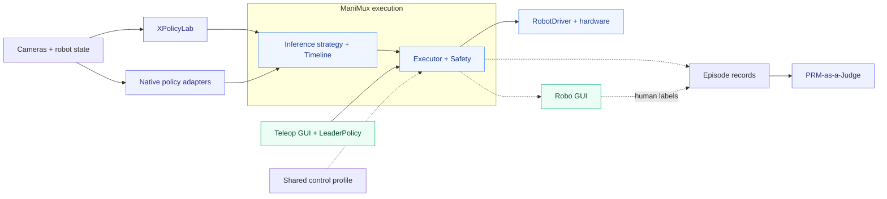

# ManiMux
**从数采、推理到评测的组合式真机实验平台。**

Any Policy × Embodiment × Inference

 

 

 

[English](README.md) · [简体中文](README.zh-CN.md)

[**Features**](#features) · [**演示**](#演示) · [**架构**](#架构) · [**使用指南**](docs/guideline.md) · [**文档**](docs/README.md)

**ManiMux 是一个覆盖数采、策略部署与评测的真机实验平台。**
它将 Policy、推理策略、Executor 与本体解耦，让研究者在同一套控制栈上比较不同方法，
通过 GUI 管理实验，并查看机器人实际执行了什么。

> 安装与启动命令见[使用指南](docs/guideline.md)；模型、算法与接口细节见[文档索引](docs/README.md)。

## Features

| 功能 | 状态 | 提供什么 |
|---|:---:|---|
| 组合式部署 | ✅ | Policy × 推理策略 × Executor × 本体 |
| 可插拔推理 | ✅ | 异步、串行、RTC、PAINT 与自适应 chunking |
| Robo GUI | ✅ | 实验控制、相机、3D 状态、轨迹和 chunk 时间线 |
| Teleop 数采 | ✅ | 主臂 Policy + YAM GUI，从臂统一走 ManiMux |
| 公共控制配置 | ✅ | 共享硬件参数、动作间隔与手臂 / 夹爪限幅 |
| 执行记录 | ✅ | 配置、观测、预测动作、下发命令、反馈、事件和视频 |
| 实验评测 | ✅ | 人工标注 + 离线 PRM / LLM Judge |
| UMI / DAgger 数采 | — | [采集路线图](docs/README.md#collection-status) |

✅ 表示已有实现，不代表所有模型 / 本体组合均已验证。
[接入数量](docs/README.md#support-counts)也包含仅模型和仿真路径。

## 演示

## 架构

数采复用执行接口，但不经过 chunk 推理调度，保留自己的 GUI 与保存格式。

**GitHub：**[ManiMux](https://github.com/SII-LiuLab/manimux) · [XPolicyLab](https://github.com/Cuzyoung/XPolicyLab) · [PRM-as-a-Judge](https://github.com/YuyangLiu2003/PRM-as-a-Judge)

## 使用指南

- **开始运行：**[完整指南](docs/guideline.md) · [配置说明](configs/README.md)。
- **模型与算法：**[组件和模型手册](docs/README.md) · [推理方法](docs/README.md#inference-and-execution)。
- **采集与评测：**[YAM 数采](docs/yam-collection.md) · [实验流程](docs/experiment-infra.md) · [PRM 评测](docs/prm-as-a-judge.md)。
- **扩展开发：**[架构与接口](docs/architecture.md)。

真机需要匹配的模型契约与硬件安全措施；软件检查不等于安全认证或任务成功。
上游来源：[声明](THIRD_PARTY_NOTICES.md) · [许可](licenses)。
