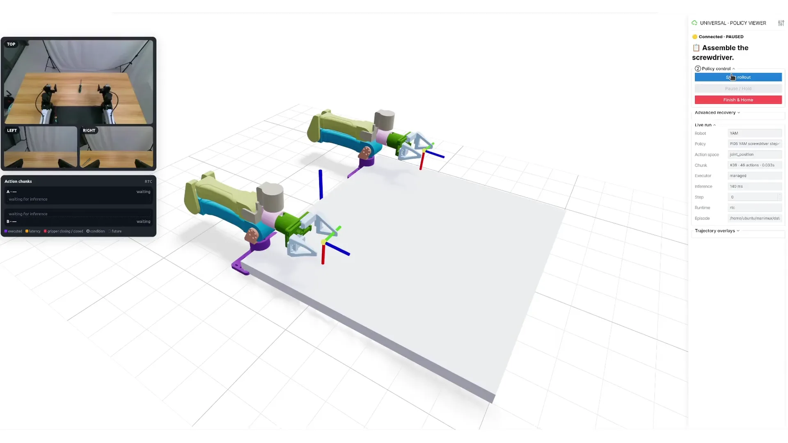
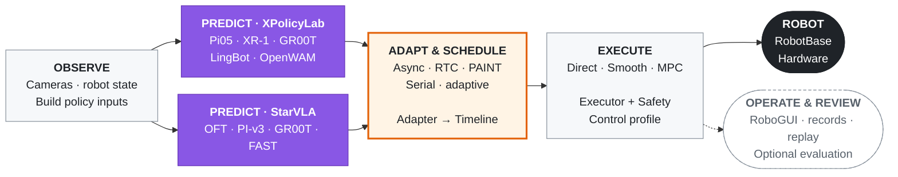

<div align="center">

<p></p>

**任何本体，任何策略，任何推理算法。**

ManiMux 是一个**可扩展的 real-world manipulation harness（真机操作运行与实验框架）**，
让不同本体、策略和推理算法的部署与实验流程**标准化**。
以 **RoboGUI** 为操作入口，结合**实时数字孪生可视化**，
运行时的设计目标是在实时可视化的同时支持 **100–200 Hz 命令执行**。

**Policy × Runtime × Embodiment**

[](https://sii-liulab.github.io/manimux/)
[](https://sii-liulab.github.io/manimux/#manimux)
[](.agents/skills/manimux-development/SKILL.md)

[](#included-integrations)
[](#included-integrations)
[](#included-integrations)
[](https://github.com/SII-LiuLab/manimux/commits/main/)

[English](README.md) · [简体中文](README.zh-CN.md)

[快速开始](#quick-start) · [架构](#architecture) · [接入开发](#integrate) · [文档](https://sii-liulab.github.io/manimux/) · [引用](#citation)

</div>

> **[阅读 ManiMux 使用与开发指南 →](https://sii-liulab.github.io/manimux/) · [Markdown 文档](docs/index.md)**
> 安装、工作站配置、模型部署、RoboGUI 使用，以及各组件的接入 protocol。
> 让 agent 开发时，从 [development skill](.agents/skills/manimux-development/SKILL.md) 开始。

## 最新动态

- **2026-10-02** — 新增 [ALOHA-AgileX](docs/usage/aloha.md) 和 [PiPER](docs/usage/piper.md) RoboGUI 演示，以及实验性的 [ARX X5 / PiPER 控制器](docs/usage/can-arms.md)，真机验证尚未完成。
- **2026-10-01** — [ManiMux 在线指南](https://sii-liulab.github.io/manimux/)上线，覆盖安装配置、部署、RoboGUI 使用与接入 protocol。
- **2026-10-01** — 更新[实验流程](docs/usage/research.md)与 [agent 接入指南](docs/development/README.md)，支持自由探索、模板研究与组件开发。

<a id="robogui"></a>

## RoboGUI



[▶ Watch the real-robot demo](assets/manimux_2026-09-05_23-17-35-00.00.03.144-00.00.34.914-seg1-00.00.02.596-00.00.34.966.mp4)

**准备 → 开始 → 暂停／结束 → 查看记录。** 自由实验不要求评分；模板研究按需启用
布局、重复次数和评价。轨迹在独立的离线页面回放，不发送机器人命令。
[使用流程 →](docs/usage/research.md)

<a id="included-integrations"></a>

## 已接入内容

- **有机器人部署配置的策略（9 类）：** Pi05、DP、SAPolicy、ABC-DiT、GR00T N1.7、LingBot-VLA2、Xiaomi XR-1、UMI DP、OpenWAM。
- **有离线配置的策略（5 类）：** Isaac 0.5，以及 StarVLA 的 QwenOFT、QwenPI-v3、QwenGR00T、QwenFast。
- **基础推理模式（8 种），并支持可选组合：** Serial、异步 chunk、RTC、ACT temporal ensembling、AAC、PAINT、AutoHorizon，以及[仅后向一致性的 BID](docs/advanced/reproductions/bid-backward.md)。
- **硬件接入（4 种）：** YAM、Tianji–TacCap，以及实验性的 ARX X5 / PiPER。**执行器：** Direct、Smooth、MPC。

另提供 [ALOHA-AgileX 从臂资产](docs/usage/aloha.md)和[标准 PiPER 资产](docs/usage/piper.md)，
用于离线 RoboGUI 展示和回放，
并提供实验性的 [ARX X5 / PiPER SDK 控制接口](docs/usage/can-arms.md)及本地配置模板。
目前完成离线接口验证，尚未进行真机部署验证。
依赖安装参见 [SDK 安装指南](docs/usage/robot-sdks.md)。

策略通过 **XPolicyLab** 或 **StarVLA** 提供服务。以上统计已有接入，
不代表所有模型 × 算法 × 本体组合都可用或已通过真机验证。
具体配置与范围见[支持目录](docs/usage/deployments.md#integration-counts)。评价是可选能力，实验设计和指标由研究者决定。

## 推理策略与组合

分别选择基础算法、请求调度，以及可选的 ACT 时间融合。原有八种基础模式保留，
新组合复用现有采样接口，不修改 XPolicyLab 或模型权重。

| 基础算法 | Serial | 异步 single_inflight | 异步 multi_inflight | 可选 ACT 融合 |
| --- | --- | --- | --- | --- |
| 普通 chunk（manimux） | 支持 | 支持 | 支持 | 使用 act_temporal_ensemble |
| ACT 时间融合 | 新增，可配置执行前缀 | 支持 | 支持 | 已启用 |
| RTC | — | 支持 | 支持 | 新增 |
| PAINT | — | 支持 | 新增 | 新增 |
| 仅后向 BID | 支持 | 支持 | 支持 | 新增 |
| AAC | 支持 | 新增 | 新增 | 新增 |
| AutoHorizon | 支持 | 新增 | 新增 | 新增 |

新增 **BID + AAC 自适应执行长度**：设置 `algorithm: bid_backward` 和
`bid.execution_horizon: aac`，同一批候选用于 AAC 选择执行长度、BID 选择动作候选。
支持 serial、single_inflight、deadline 和 multi_inflight，也可叠加 ACT。这与 AAC 原有的
`aac.chunk_id_selector: backward` 不同，后者在归一化末端运动空间按候选编号比较批次。

新增 **ACT + serial**，`chunk_policy_steps` 表示执行长度：

```yaml
inference:
  algorithm: act_temporal_ensemble
  inference_schedule: serial
  chunk_policy_steps: 5
  action_start_mode: first_step_when_ready
  blend_policy_steps: 0
```

保留完整预测用于融合，执行五个策略步后再请求下一次推理。融合按各预测实际提交的时间对齐，
包含推理等待和不足一个策略步的时间偏移；没有有效重叠时仅使用新预测。
不设置 `chunk_policy_steps` 时执行完整 chunk。异步 ACT 的查询间隔保持原义，不控制串行执行。

位于 `configs/experiments/put_bottles/pi05/` 的实验可这样选择：

```yaml
inference:
  config: ../../../inference/yam_autohorizon_multi_inflight.yaml
  temporal_ensemble:
    enabled: true
```

使用 `yam_bid_aac.yaml` 可选择串行 BID + AAC；新增预设还包括
`yam_{aac,autohorizon}_{single_inflight,multi_inflight}.yaml` 和
`yam_paint_multi_inflight.yaml`，串行 ACT 可选择 `yam_act_serial.yaml`。
RTC、PAINT、BID 等预设可保留基础算法并添加
`temporal_ensemble.enabled: true`，同时设置 `blend_policy_steps: 0`。
基础算法仍决定请求时机，ACT 独立模式的查询间隔不会覆盖它；串行融合可能没有有效重叠。

单请求异步等待上一次返回，多请求异步按 `observation_hz` 上传，服务器只保留最新待处理观测，
模型仍串行执行。普通 chunk/BID/AAC/AutoHorizon 的 `request_trigger` 可选择 refill 或 continuous。
旧 `deadline` 对普通 chunk/BID 保持原义；RTC/PAINT/ACT 转为 single_inflight，
AAC/AutoHorizon 转为 serial，保持旧配置行为。

异步自适应模式使用 `drop_infer_latency`，延迟消耗选定的源动作前缀，不能从回复时刻重新执行
同样数量的动作；前缀全部过期时拒绝回复。RTC/PAINT 多请求模式拒绝引用旧计划的回复，
叠加 ACT 后基于实际接收的融合计划构建下一次条件；新增 RTC/PAINT 组合按观测的精确时间戳
采样条件目标。BID 仍保留未融合的选中预测用于后向评分。
新组合的历史仅在计划接收后生效。

新组合限定为 inline 完整绝对关节解码（JointAdapter 系列），ACT 和异步自适应禁用额外
blending/skip。AAC 组合使用 ManiMux 的 XPolicyLab 客户端并需要适合该本体的 EE 统计。
服务器仍须提供真实采样能力。原有串行 AAC/AutoHorizon 和异步 ACT 保持原有路径。
新组合已进行离线检查，尚未验证真实权重、机器人表现或任务收益。
RTC + PAINT、多候选条件采样及 AutoHorizon 与其他采样器的组合仍不支持。
详情见[调度与组合契约](docs/advanced/inference.md)和[预设目录](manimux/configs/inference/README.md)。

<a id="architecture"></a>

## 架构

模型框架负责推理；ManiMux 负责观测与动作适配、调度、执行和实验操作。
推理策略决定请求与 chunk 交接，执行器根据时间线参考生成命令。


```mermaid
%%{init: {"flowchart": {"wrappingWidth": 180, "curve": "basis", "nodeSpacing": 24, "rankSpacing": 28, "padding": 14}}}%%
flowchart LR
    OBS["<b>OBSERVE</b><br/>Cameras · robot state<br/>Build policy inputs"]:::stage

    XPOLICY["<b>PREDICT · XPolicyLab</b><br/>Pi05 · XR-1 · GR00T<br/>LingBot · OpenWAM"]:::xpolicy

    STARVLA["<b>PREDICT · StarVLA</b><br/>OFT · PI-v3 · GR00T · FAST"]:::xpolicy

    PLAN["<b>ADAPT & SCHEDULE</b><br/>Async · RTC · PAINT<br/>Serial · adaptive<br/><br/>Adapter → Timeline"]:::handoff
    ACT["<b>EXECUTE</b><br/>Direct · Smooth · MPC<br/><br/>Executor + Safety<br/>Control profile"]:::stage
    ROBOT(["<b>ROBOT</b><br/>RobotBase<br/>Hardware"]):::robot
    REVIEW(["<b>OPERATE & REVIEW</b><br/>RoboGUI · records · replay<br/>Optional evaluation"]):::side

    OBS --> XPOLICY --> PLAN --> ACT --> ROBOT
    OBS --> STARVLA --> PLAN
    ACT -.-> REVIEW

    classDef stage fill:#F6F8FA,stroke:#8C959F,stroke-width:1px,color:#1F2328
    classDef handoff fill:#FFF4E5,stroke:#E36209,stroke-width:2.5px,color:#1F2328
    classDef side fill:#FFFFFF,stroke:#8C959F,stroke-dasharray:4 3,color:#57606A
    classDef robot fill:#1F2328,stroke:#1F2328,color:#FFFFFF
    classDef xpolicy fill:#8957E5,stroke:#6633B8,color:#FFFFFF
```

XPolicyLab 和 StarVLA 使用独立的服务环境，通过各自的 ManiMux client 接入。
新框架复用同一 client protocol；新本体按组件和装配接口接入。
[接入地图 →](docs/development/README.md)

<a id="quick-start"></a>

## 快速开始

### 无硬件体验

准备 Python 3.11 或 3.12，以及 [uv](https://docs.astral.sh/uv/)：

```bash
git clone https://github.com/SII-LiuLab/manimux.git
cd manimux
uv sync --dev
uv run manimux-robogui --robot yam --demo --host 127.0.0.1 --port 8086
```

打开 **http://127.0.0.1:8086**。示例使用合成数据和随项目提供的 YAM 模型，不连接机器人。
只有选择真实模型部署时，才需要对应的框架子模块和 checkpoint。

同一环境下，可以直接预览新接入的臂：

```bash
uv run manimux-robogui --robot piper --demo --host 127.0.0.1 --port 8087
```

打开 **http://127.0.0.1:8087**；将 `--robot piper` 换成 `--robot aloha` 可预览 ALOHA-AgileX。
两者均用合成数据展示手臂与夹爪运动，不需要设备 SDK。
ARX X5 目前提供运动学模型和实验性控制器，尚无随项目打包的 RoboGUI 网格预设。

更新已有安装时，参见 [RoboGUI 接口迁移说明](docs/usage/getting-started.md#updating-older-installations)。

### 使用自己的机器人

1. 选择[模型／本体指南](docs/usage/deployments.md)，安装相应的硬件和模型环境。
2. 在私有 [station 文件](docs/usage/station.md)中绑定设备、服务地址与 checkpoint 路径。
3. 按照[完整 Pi05/YAM 示例](docs/usage/getting-started.md#pi05-30k-on-yam)或对应模型指南，启动相机、RoboGUI、模型服务和 runtime。
4. 之后在 RoboGUI 填写任务、准备、运行、结束和查看记录。

`manimux serve` 保持服务运行，供 GUI 连续开展多次实验；`manimux run` 运行一次 rollout。
Prepare 可能根据配置连接机器人并移动到起始姿态，请使用与你的设备匹配的指南。

[配置说明](manimux/configs/README.md) · [带注释的实验示例](manimux/configs/examples/README.md)

<a id="integrate"></a>

## 接入开发

**用户**通过配置和 RoboGUI 使用项目；**用户的 agent** 按任务读取
[开发 skill](.agents/skills/manimux-development/SKILL.md)或下方对应 skill。
如果使用的工具不会自动发现仓库 skill，直接让它读取链接中的 `SKILL.md`。

| 要做的事 | 文档入口 |
| --- | --- |
| 接入机械臂、夹爪、相机或新本体 | [组件 protocol](docs/development/components.md) |
| 接入模型、上层框架或动作 adapter | [Policy protocol](docs/development/policies.md) |
| 接入推理算法、执行器或 GUI 功能 | [Runtime protocol](docs/development/runtime-config.md) |
| 在新实验室连接已有本体 | [Station skill](.agents/skills/manimux-station-setup/SKILL.md) |
| 分析自己的实验记录 | [Experiment skill](.agents/skills/manimux-experiments/SKILL.md) |

每种接入都应说明数据语义、代码归属、YAML 选择方式和验证结果。

**欢迎一起建设 ManiMux。** 无论是新本体、策略、推理算法，还是文档完善与问题修复，都欢迎贡献。
请从[接入指南](docs/development/README.md)开始，遵循共享 protocol，并参考[贡献指南](docs/development/README.md#contributing)完成交付。

## 支持情况

[支持目录](docs/usage/deployments.md)列出模型、本体、算法和验证记录。
能力取决于实际 checkpoint 与 backend；已接入不代表每一种组合都通过了真机验证。
项目仍在持续开发，各部署指南说明对应配置的验证范围。

<a id="citation"></a>

## 引用

如果 ManiMux 支持了你的研究，请引用：

**ManiMux: An Extensible Real-World Manipulation Harness**

```bibtex
@misc{manimux2026,
  title = {{ManiMux}: An Extensible Real-World Manipulation Harness},
  year = {2026},
  howpublished = {GitHub repository},
  url = {https://github.com/SII-LiuLab/manimux}
}
```

使用相关组件时，也请引用对应项目及实际使用的模型或算法：
[XPolicyLab](https://github.com/XPolicyLab/XPolicyLab)、[StarVLA](https://github.com/starVLA/starVLA)、[PRM-as-a-Judge](https://github.com/YuyangLiu2003/PRM-as-a-Judge)。

<details>
<summary>相关项目的官方 BibTeX（按实际使用选择）</summary>

[XPolicyLab](https://arxiv.org/abs/2608.09892)

```bibtex
@article{community2026xpolicylab,
  title={{XPolicyLab}: A Unified Standard and Open Ecosystem for Robot Policy Evaluation and Deployment},
  author={Community, XPolicyLab and Chen, Tianxing and Chen, Yue and Nian, Tian and Cai, Zijian and Chen, Guangyu and Lin, Wenwei and Liang, Qiwei and Xiang, Peicheng and Su, Kailun and others},
  journal={arXiv preprint arXiv:2608.09892},
  year={2026}
}
```

[StarVLA](https://arxiv.org/abs/2604.05014)

```bibtex
@article{community2026starvla,
  title={StarVLA: A Lego-like Codebase for Vision-Language-Action Model Developing},
  author={Community, StarVLA},
  journal={arXiv preprint arXiv:2604.05014},
  year={2026},
  eprint={2604.05014},
  archivePrefix={arXiv},
  primaryClass={cs.RO}
}
```

[PRM-as-a-Judge 1.5 — 工具包技术报告](https://arxiv.org/pdf/2608.14284)

```bibtex
@article{liu2026prmjudge15,
  title   = {PRM-as-a-Judge 1.5: A Toolkit for Robot Process Assessment},
  author  = {Liu, Yuyang and Shen, Yanqing and Chen, Ruike and Zhao, Jifan and Tian, Yuxuan and Zhang, Yichi and Long, Tianfeng and Yin, Zixuan and Wang, Yipu and Qin, Ziheng and Tan, Wenxing and Shi, Yang and Cao, Mingyu and Xiao, Runze and Wang, Ziqi and Yin, Zhixin and Chu, Shiwei and Zhang, Yi-Fan and Mu, Yao and Ji, Yuheng and Wang, Yihao and Yan, Jun and Wang, Zhongyuan and Wang, Pengwei and Zheng, Xiaolong},
  journal = {arXiv preprint arXiv:2608.14284},
  year    = {2026},
  url     = {https://arxiv.org/pdf/2608.14284}
}
```

[PRM-as-a-Judge — 原始方法论文](https://arxiv.org/abs/2603.21669)

```bibtex
@article{ji2026prmjudge,
  title   = {PRM-as-a-Judge: A Dense Evaluation Paradigm for Fine-Grained Robotic Auditing},
  author  = {Ji, Yuheng and Liu, Yuyang and Tan, Huajie and Huang, Xuchuan and Huang, Fanding and Xu, Yijie and Chi, Cheng and Zhao, Yuting and Lyu, Huaihai and Co, Peterson and others},
  journal = {arXiv preprint arXiv:2603.21669},
  year    = {2026}
}
```

</details>

[第三方声明](licenses/THIRD_PARTY_NOTICES.md) · [上游许可证](licenses) · [完整文档](docs/index.md)

## 许可证

[](pyproject.toml)
[](LICENSE)

ManiMux 使用 [MIT](LICENSE) 许可证。第三方框架、SDK 与资产保留各自的许可证，
详见[第三方声明](licenses/THIRD_PARTY_NOTICES.md)。
