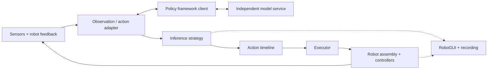

# Architecture

ManiMux composes policy inference, real-robot execution and experiment operation.

The main loop reuses these boundaries across configurations. Inference scheduling
owns requests and chunk handoff; the timeline samples references; the executor
produces commands; controllers own hardware connections. RoboGUI controls the
rollout lifecycle and displays evidence through runtime messages.

| Boundary | Contract | Details |
| --- | --- | --- |
| Framework → client | `PolicyModel` | [Policies](policies.md) |
| Client → robot action representation | `PolicyAdapter`, `ActionChunk` | [Adapters](policies.md#observation-and-action-adapter) |
| Scheduling → timeline | `InferenceStrategy`, `ActionTimeline` | [Runtime](runtime-config.md) |
| Reference → command | `Executor`, `RobotCommand` | [Execution](runtime-config.md#inference-algorithm-versus-executor) |
| Robot → hardware | `RobotBase`, `ArmController`, `SensorBase` | [Components](components.md) |
| Runtime → user | RoboGUI messages, saved rollout records | [Research workflow](../usage/research.md) |

Units, timestamps, group order and action meaning are part of each contract.
The same interface does not imply identical device capabilities or that every
model/robot combination has been physically tested.

Start a new integration with the [extension map](README.md).
Model implementations stay in their owning framework. Teleoperation and
demonstration collection are outside ManiMux; runtime recording and offline
replay remain part of the platform.
