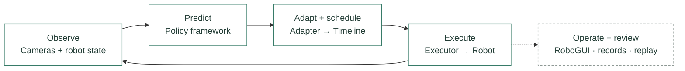

---
hide:
  - toc
---

Documentation / Real-robot research

# ManiMux

An extensible real-world manipulation harness.

**Any embodiment. Any policy. Any inference strategy.**

ManiMux **standardizes** deployment and experiment workflows across embodiments,
policies, and inference strategies. Built around **RoboGUI**, it brings together
**live digital twin visualization** and a runtime designed for **100–200 Hz command execution**.

<a href="usage/getting-started.md">Get started ↗</a>
<a href="development/README.md">Development protocols ↗</a>
<a href="https://github.com/SII-LiuLab/manimux">GitHub ↗</a>

<figure class="guide-demo">
<video class="guide-video" controls playsinline preload="none" poster="assets/media/robogui.webp" aria-label="RoboGUI demonstration with a YAM robot">
<source src="assets/media/demo.mp4" type="video/mp4">
Your browser does not support inline video.
</video>
<figcaption>RoboGUI · YAM deployment. Demo footage; some controls have since changed.</figcaption>
</figure>
<nav class="guide-start" aria-label="Getting started paths">

Start with your setup

<a href="usage/getting-started.md">01<strong>Try RoboGUI</strong><small>Explore the demo without hardware.</small>→</a>
<a href="usage/station.md">02<strong>Connect your station</strong><small>Bind robots, cameras and services.</small>→</a>
<a href="usage/deployments.md">03<strong>Run a policy</strong><small>Choose a recipe and start inference.</small>→</a>
<a href="usage/research.md">04<strong>Manage experiments</strong><small>Free exploration or a study template.</small>→</a>
</nav>

## One workflow, interchangeable components

Model frameworks own inference. ManiMux connects observations, action conversion,
chunk scheduling and command execution. RoboGUI lets you operate the experiment;
recording and replay let you inspect what happened. Evaluation is optional.

[Architecture and ownership →](development/architecture.md)

### Use ManiMux

Choose an experiment config, start the services, and work from RoboGUI.

- [PiPER and ALOHA RoboGUI previews](usage/getting-started.md#hardware-free-start)
- [Configuration: what belongs where](usage/configuration.md)
- [Free rollouts and study templates](usage/research.md)
- [Saved records and offline replay](usage/replay.md)
- [Optional evaluation](usage/evaluation.md)

### Extend with your agent

Give your agent the [development skill](../.agents/skills/manimux-development/SKILL.md).
It routes each integration to its existing interface and protocol.

- [Robots, grippers, cameras and digital twins](development/components.md)
- [Models, frameworks and action adapters](development/policies.md)
- [Inference strategies, executors and RoboGUI](development/runtime-config.md)
- [Integration map and validation](development/README.md)

Model training and demonstration collection remain in their own tools.
Choose your own research questions, experiment plans and evaluation criteria.

## Citation

**[ManiMux: An Extensible Real-World Manipulation Harness](../README.md#citation)**

Find ready-to-copy BibTeX in the [citation guide](../README.md#citation), including
XPolicyLab, StarVLA and PRM-as-a-Judge. Cite the components used in your research.
